# Arquitectura Detallada del Backend de Vintara

Este documento explica de manera detallada el rol y la interacción de las **12 tecnologías clave** integradas en el backend de la plataforma **WineSoft (Vintara)**. Para cada tecnología se detalla su función, su método de implementación en el sistema, los archivos involucrados y su comportamiento mediante un gráfico de secuencia en formato PlantUML.

---

## 1. Variables de Entorno (`.env`)

### Función
Separar los datos de configuración sensible (contraseñas de base de datos, claves secretas, emisores de tokens) del código fuente y del repositorio público, inyectándolos en tiempo de ejecución.

### Cómo se cumple
Las contraseñas de las bases de datos y la clave del JWT se obtienen mediante la interfaz genérica `IConfiguration`. En el entorno local, se provee el archivo [.env.example](.env.example) para crear un archivo `.env` que Docker Compose lee y mapea como variables de entorno del sistema operativo dentro de los contenedores de cada servicio en [docker-compose.yml](docker-compose.yml).

### Archivos clave
* [.env.example](.env.example)
* [docker-compose.yml](docker-compose.yml)
* [AuthQueryService.cs](src/AuthService/WinesoftPlatform.AuthService/application/internal/queryservices/AuthQueryService.cs) (lee `Jwt:Key` dinámicamente)

### Diagrama de Secuencia
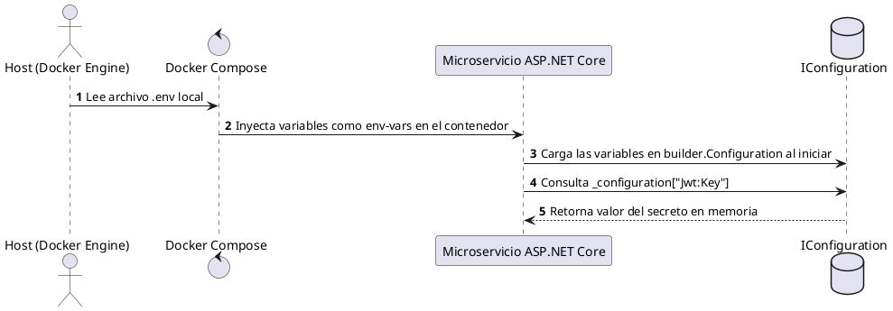

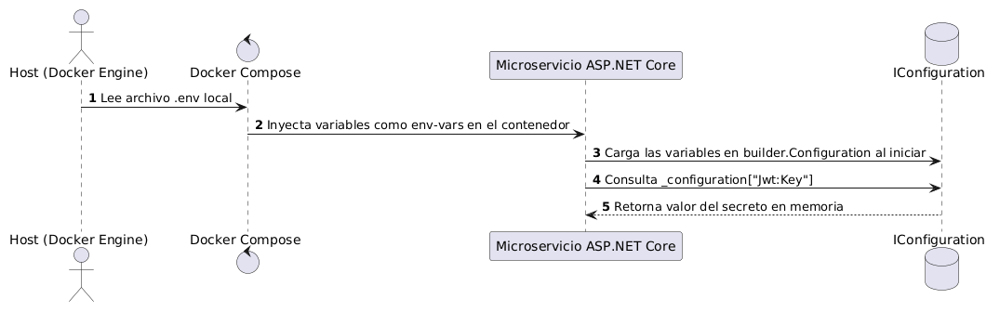

---

## 2. Autenticación JWT Bearer

### Función
Proteger los endpoints del backend, permitiendo validar la identidad de los usuarios de forma descentralizada sin sobrecargar la base de datos en cada petición.

### Cómo se cumple
Cada microservicio independiente utiliza el middleware nativo `Microsoft.AspNetCore.Authentication.JwtBearer` para descifrar y validar localmente la firma del token recibido en la cabecera HTTP `Authorization: Bearer <token>`. La firma se valida utilizando la clave secreta compartida configurada mediante variables de entorno.

### Archivos clave
* [ProfilesService/Program.cs](src/ProfilesService/WinesoftPlatform.ProfilesService/Program.cs) (Configuración de JwtBearer)
* [PurchaseService/Program.cs](src/PurchaseService/WinesoftPlatform.PurchaseService/Program.cs) (Configuración de JwtBearer)
* [InventoryService/Program.cs](src/InventoryService/WinesoftPlatform.InventoryService/Program.cs) (Configuración de JwtBearer)
* [AnalyticsService/Program.cs](src/AnalyticsService/WinesoftPlatform.AnalyticsService/Program.cs) (Configuración de JwtBearer)

### Diagrama de Secuencia
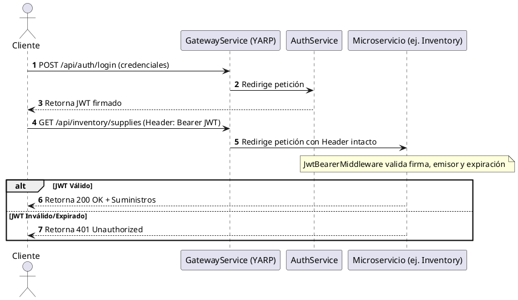

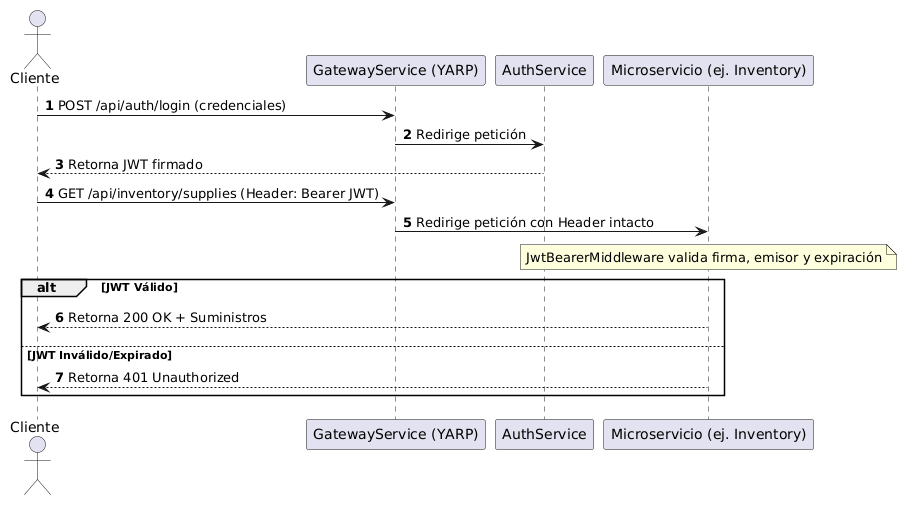

---

## 3. Aislamiento Multi-Tenant por `OwnerId`

### Función
Garantizar la privacidad lógica de los datos entre diferentes dueños de negocio (tenants), impidiendo que un usuario acceda, modifique o visualice registros pertenecientes a otro (vulnerabilidades IDOR).

### Cómo se cumple
Las entidades de base de datos como `Supply` y `Order` poseen un atributo de persistencia `OwnerId`. En la capa de controladores web, se extrae el ID del usuario directamente desde el token JWT previamente validado, inyectándolo de manera forzosa en los parámetros de los comandos y consultas que se dirigen a los repositorios de persistencia.

### Archivos clave
* [PurchaseOrdersController.cs](src/PurchaseService/WinesoftPlatform.PurchaseService/Interfaces/REST/PurchaseOrdersController.cs) (método `GetOwnerId`)
* [SuppliesController.cs](src/InventoryService/WinesoftPlatform.InventoryService/Interfaces/REST/SuppliesController.cs) (método `GetOwnerId`)
* [OrderRepository.cs](src/PurchaseService/WinesoftPlatform.PurchaseService/Infrastructure/Persistence/EFC/Repositories/OrderRepository.cs) (filtra queries con `Where(o => o.OwnerId == ownerId)`)
* [SupplyRepository.cs](src/InventoryService/WinesoftPlatform.InventoryService/Infrastructure/Persistence/EFC/Repositories/SupplyRepository.cs) (filtra queries con `Where(s => s.OwnerId == ownerId)`)

### Diagrama de Secuencia
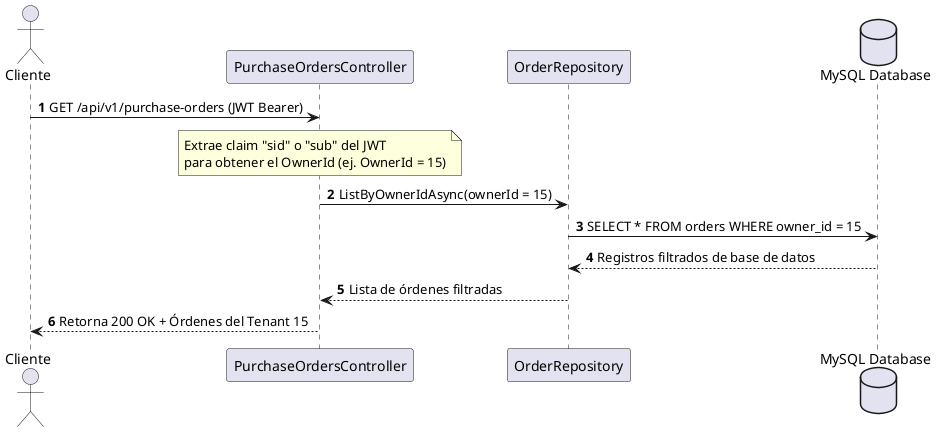

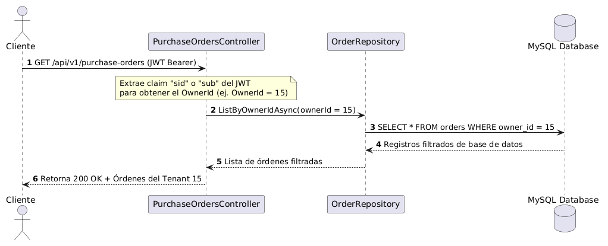

---

## 4. Polly (Microsoft.Extensions.Http.Resilience)

### Función
Asegurar la tolerancia a fallos transitorios en las comunicaciones síncronas HTTP entre microservicios, previniendo caídas en cadena en el ecosistema.

### Cómo se cumple
Se decora el cliente HTTP utilizado por `PurchaseService` hacia `InventoryService` utilizando `.AddStandardResilienceHandler` provisto por Polly. Este manejador configura de manera automática políticas de reintentos rápidos con esperas incrementales (Backoff exponencial) y límites de tiempo por llamada.

### Archivos clave
* [PurchaseService/Program.cs](src/PurchaseService/WinesoftPlatform.PurchaseService/Program.cs) (registro de `AddStandardResilienceHandler`)
* [WinesoftPlatform.PurchaseService.csproj](src/PurchaseService/WinesoftPlatform.PurchaseService/WinesoftPlatform.PurchaseService.csproj) (librería `Microsoft.Extensions.Http.Resilience`)

### Diagrama de Secuencia
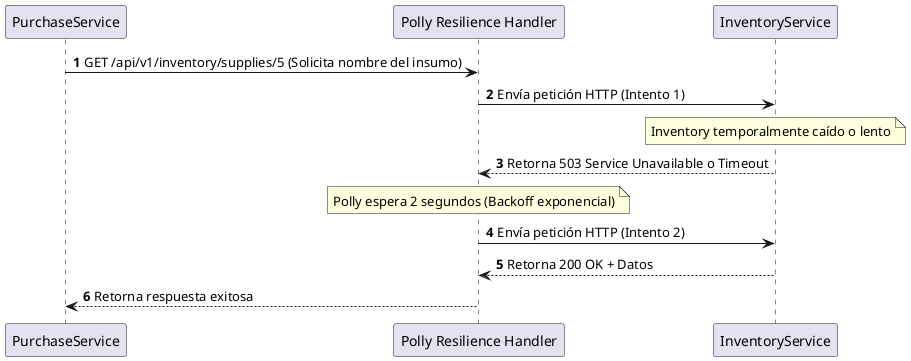

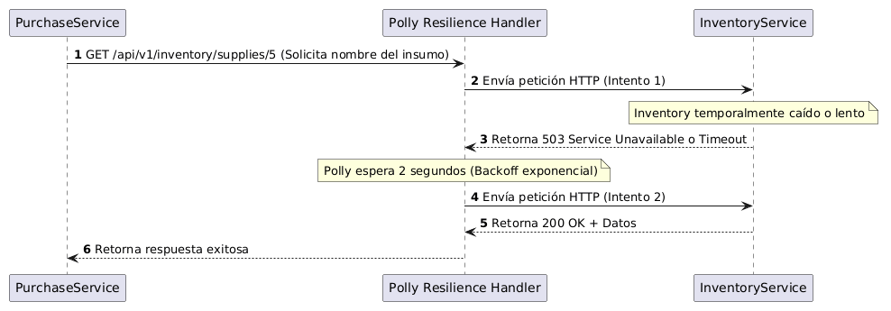

---

## 5. Rate Limiting (Microsoft.AspNetCore.RateLimiting)

### Función
Proteger el sistema de sobrecargas intencionales o accidentales, ataques de denegación de servicio (DoS) y ataques de fuerza bruta.

### Cómo se cumple
Se definen políticas de límite de peticiones de tipo ventana fija:
* `AuthRateLimit` en `AuthService`: Limita a 5 peticiones por minuto por IP remota para los endpoints críticos de autenticación.
* `GatewayRateLimit` en `GatewayService`: Protege el punto de entrada global limitando a 60 peticiones por minuto por IP remota para todo el tráfico.

### Archivos clave
* [GatewayService/Program.cs](src/GatewayService/WinesoftPlatform.GatewayService/Program.cs) (política `GatewayRateLimit`)
* [AuthService/Program.cs](src/AuthService/WinesoftPlatform.AuthService/Program.cs) (política `AuthRateLimit`)
* [AuthController.cs](src/AuthService/WinesoftPlatform.AuthService/interfaces/REST/AuthController.cs) (atributo `[EnableRateLimiting("AuthRateLimit")]`)

### Diagrama de Secuencia
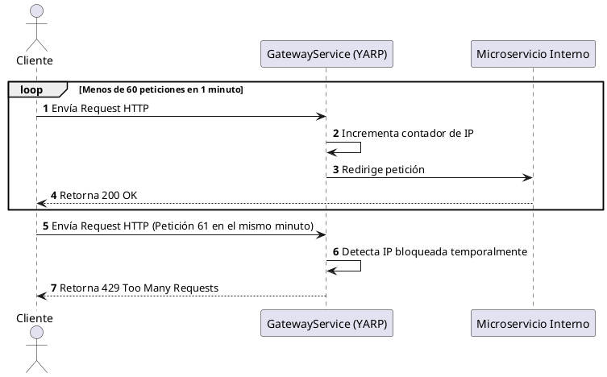

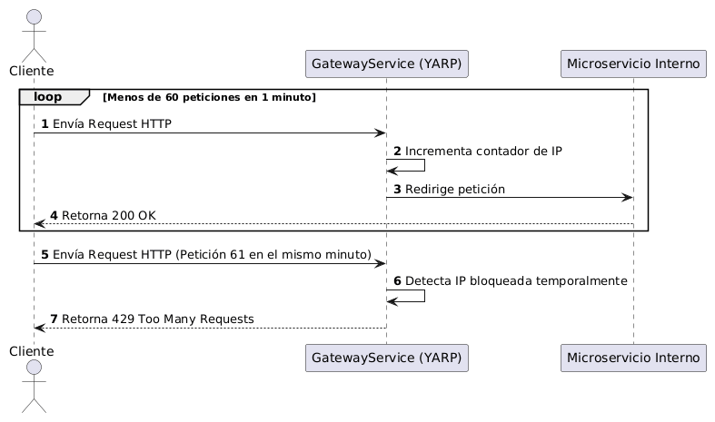

---

## 6. YARP (Yet Another Reverse Proxy)

### Función
Proveer un único punto de entrada unificado (API Gateway) para los clientes externos, ocultando los puertos y la topología interna de la red de microservicios.

### Cómo se cumple
Se utiliza el reverse proxy YARP en `GatewayService`. Escucha peticiones externas en el puerto `5000` y las enruta dinámicamente hacia las direcciones de Docker internas de cada microservicio en el puerto `8080` (ej: `http://auth-service:8080`), reescribiendo los prefijos de las rutas según la configuración establecida.

### Archivos clave
* [GatewayService/Program.cs](src/GatewayService/WinesoftPlatform.GatewayService/Program.cs) (registro de proxy)
* [GatewayService/appsettings.json](src/GatewayService/WinesoftPlatform.GatewayService/appsettings.json) (definición de rutas y clusters)

### Diagrama de Secuencia
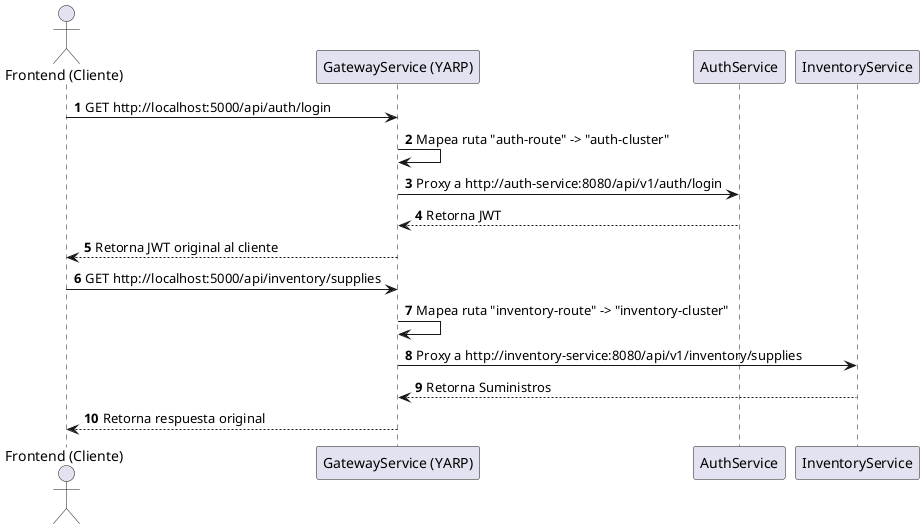

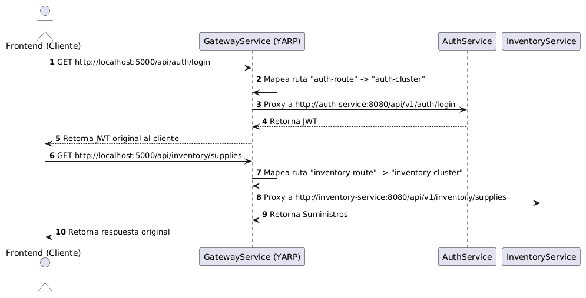

---

## 7. Serilog + Correlation ID

### Función
Facilitar el rastreo y análisis de logs en sistemas distribuidos, permitiendo correlacionar múltiples entradas de log generadas en diferentes microservicios como resultado de una misma solicitud de usuario.

### Cómo se cumple
Un middleware transversal intercepta cada petición en el API Gateway. Si no existe un identificador `X-Correlation-Id`, se genera un UUID único y se adjunta a las cabeceras HTTP. Cuando el Gateway delega la petición a los microservicios internos mediante YARP, la cabecera se propaga. Los microservicios leen esta cabecera y empujan el valor en el contexto de diagnóstico de Serilog (`LogContext`).

### Archivos clave
* [CorrelationIdMiddleware.cs](src/Shared/WinesoftPlatform.Shared/Infrastructure/Middleware/CorrelationIdMiddleware.cs) (lógica del middleware)
* [GatewayService/Program.cs](src/GatewayService/WinesoftPlatform.GatewayService/Program.cs) (uso de middleware y configuración de logger)

### Diagrama de Secuencia
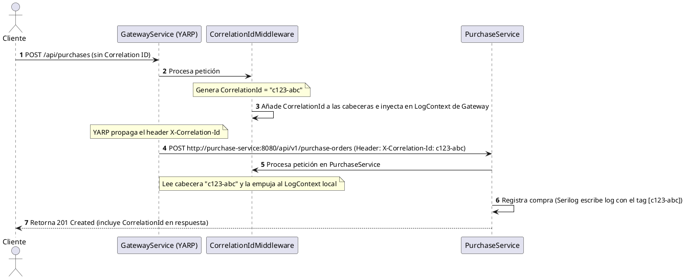

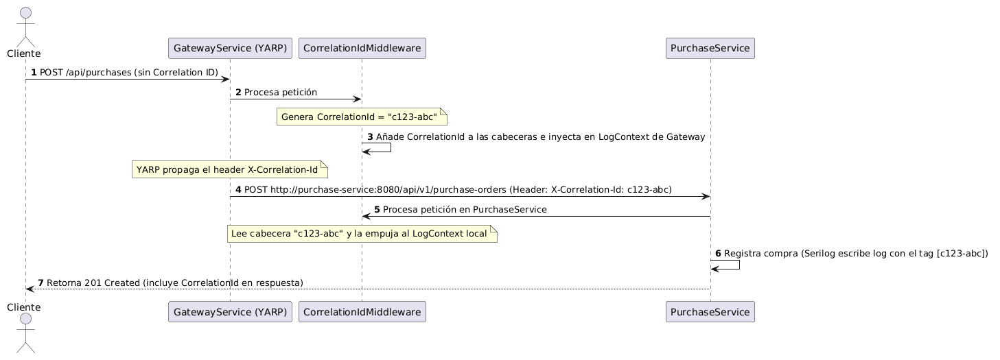

---

## 8. Migraciones formales de Entity Framework Core

### Función
Gestionar la evolución del esquema de la base de datos de manera incremental, controlada y versionada, evitando pérdidas de datos en entornos de desarrollo y producción.

### Cómo se cumple
Se reemplazó el uso de la función destructiva `EnsureCreated()` por un esquema formal de migraciones de EF Core. Durante la compilación y arranque de cada contenedor de microservicio, se ejecuta la migración pendiente de base de datos MySQL de forma automática mediante la llamada `dbContext.Database.Migrate()`.

### Archivos clave
* [InventoryDbContextModelSnapshot.cs](src/InventoryService/WinesoftPlatform.InventoryService/Migrations/InventoryDbContextModelSnapshot.cs)
* [PurchaseDbContextModelSnapshot.cs](src/PurchaseService/WinesoftPlatform.PurchaseService/Migrations/PurchaseDbContextModelSnapshot.cs)
* [InventoryService/Program.cs](src/InventoryService/WinesoftPlatform.InventoryService/Program.cs) (llamada `Database.Migrate()`)
* [PurchaseService/Program.cs](src/PurchaseService/WinesoftPlatform.PurchaseService/Program.cs) (llamada `Database.Migrate()`)

### Diagrama de Secuencia
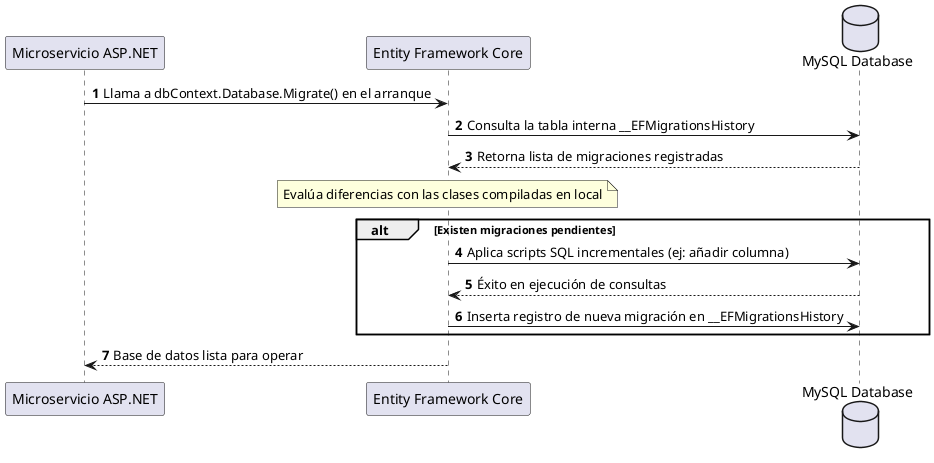

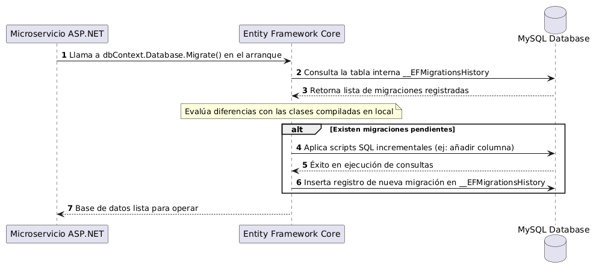

---

## 9. GitHub Actions (.github/workflows/ci.yml)

### Función
Automatizar las validaciones de integración continua (CI) en el repositorio para evitar mezclar cambios que rompan la compilación, introduzcan vulnerabilidades NuGet conocidas o impidan la generación de las imágenes Docker.

### Cómo se cumple
El workflow está configurado en [.github/workflows/ci.yml](.github/workflows/ci.yml). Al realizar un push o pull request a las ramas `main` o `develop`, se inicia un agente runner que restaura paquetes, compila el proyecto controlando warnings críticos (`/warnaserror:NU1902`), ejecuta las pruebas y construye localmente los archivos Docker para cada servicio.

### Archivos clave
* [ci.yml](.github/workflows/ci.yml)

### Diagrama de Secuencia
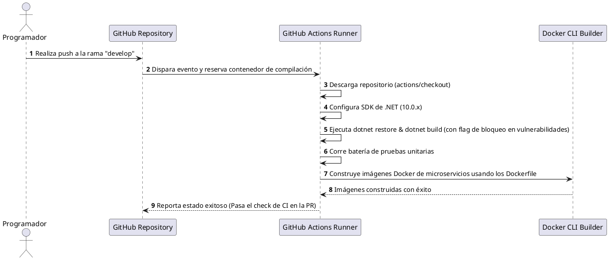

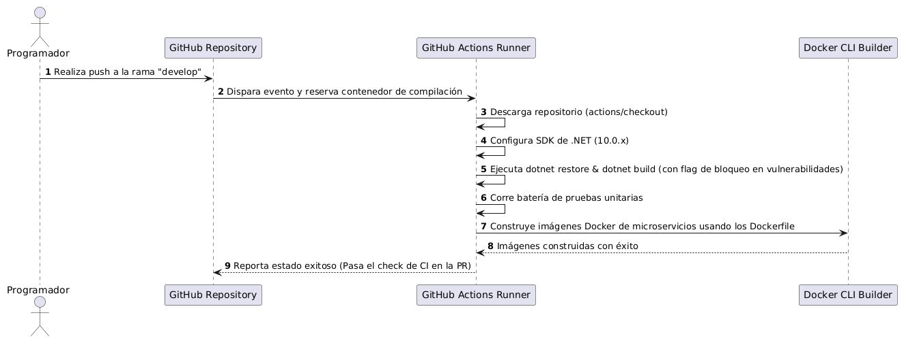

---

## 10. Actualización de paquetes JWT (Vulnerabilidad CVE-2024-21319)

### Función
Resolver vulnerabilidades críticas conocidas que podrían derivar en un ataque de denegación de servicio (DoS) o evasión de controles al validar tokens JSON Web Token.

### Cómo se cumple
Se actualizaron las referencias de paquetes en los archivos `.csproj` a versiones seguras. El compilador de dotnet controla que no se utilicen versiones vulnerables de estas librerías mediante la validación estricta de errores NuGet del compilador (`/warnaserror:NU1902`) que se ejecuta durante el pipeline en GitHub Actions.

### Archivos clave
* [WinesoftPlatform.AuthService.csproj](src/AuthService/WinesoftPlatform.AuthService/WinesoftPlatform.AuthService.csproj) (paquete `System.IdentityModel.Tokens.Jwt` en versión `8.0.0` o superior)
* [WinesoftPlatform.InventoryService.csproj](src/InventoryService/WinesoftPlatform.InventoryService/WinesoftPlatform.InventoryService.csproj) (paquete `Microsoft.AspNetCore.Authentication.JwtBearer` en versión `9.0.10` o superior)

### Diagrama de Secuencia
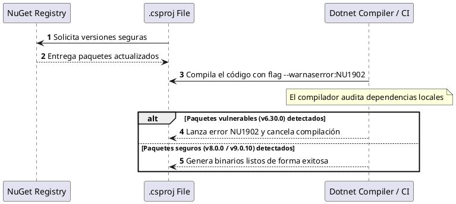

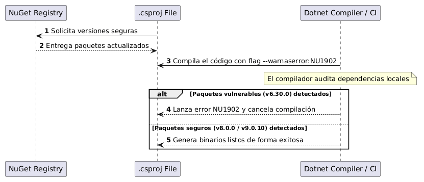

---

## 11. RabbitMQ + MassTransit

### Función
Habilitar una arquitectura guiada por eventos asíncronos para desacoplar los servicios en operaciones de escritura, aumentando la disponibilidad y escalabilidad horizontal del backend.

### Cómo se cumple
Cuando `PurchaseService` crea una orden, publica de manera asíncrona un evento de integración `OrderCreated` a RabbitMQ utilizando la abstracción de MassTransit. Los microservicios interesados (`InventoryService` y `AnalyticsService`) implementan consumidores (`IConsumer<OrderCreated>`) para actualizar sus estados locales en segundo plano, sin requerir una comunicación síncrona en tiempo real.

### Archivos clave
* [OrderCreated.cs](src/Shared/WinesoftPlatform.Shared/Domain/Events/OrderCreated.cs) (clase del evento)
* [OrderCommandService.cs](src/PurchaseService/WinesoftPlatform.PurchaseService/Application/Internal/CommandServices/OrderCommandService.cs) (publica evento al confirmar compra)
* [OrderCreatedConsumer.cs (Inventory)](src/InventoryService/WinesoftPlatform.InventoryService/Application/Internal/Consumers/OrderCreatedConsumer.cs) (resta stock de insumos)
* [OrderCreatedConsumer.cs (Analytics)](src/AnalyticsService/WinesoftPlatform.AnalyticsService/Application/Internal/Consumers/OrderCreatedConsumer.cs) (invalida reportes estadísticos y actualiza KPIs)

### Diagrama de Secuencia
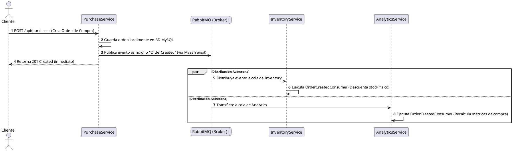

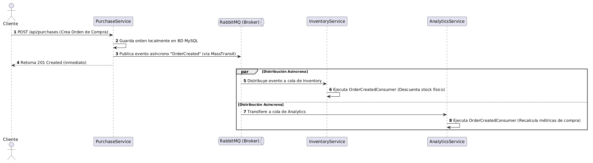

---

## 12. Redis

### Función
Cachear en memoria estructurada de lectura rápida los reportes complejos generados por el microservicio de analítica, reduciendo peticiones duplicadas y carga de cálculo en MySQL.

### Cómo se cumple
Se inyecta la abstracción `IDistributedCache` integrada con StackExchange.Redis en `AnalyticsService`. Al realizar una solicitud de reportes o KPIs, se comprueba si la información serializada está disponible en Redis bajo una llave que incluye el ID del dueño de negocio (`OwnerId`). Si no existe (Cache Miss), se realiza la lectura y agregación pesada en la base de datos MySQL, guardando el resultado serializado en caché con un tiempo de expiración determinado.

### Archivos clave
* [AnalyticsCacheService.cs](src/AnalyticsService/WinesoftPlatform.AnalyticsService/Infrastructure/Services/AnalyticsCacheService.cs) (abstracción del caché)
* [AnalyticsQueryService.cs](src/AnalyticsService/WinesoftPlatform.AnalyticsService/Application/Internal/QueryServices/AnalyticsQueryService.cs) (gestiona cache hits y miss)
* [AnalyticsService/Program.cs](src/AnalyticsService/WinesoftPlatform.AnalyticsService/Program.cs) (registro de `AddStackExchangeRedisCache`)

### Diagrama de Secuencia
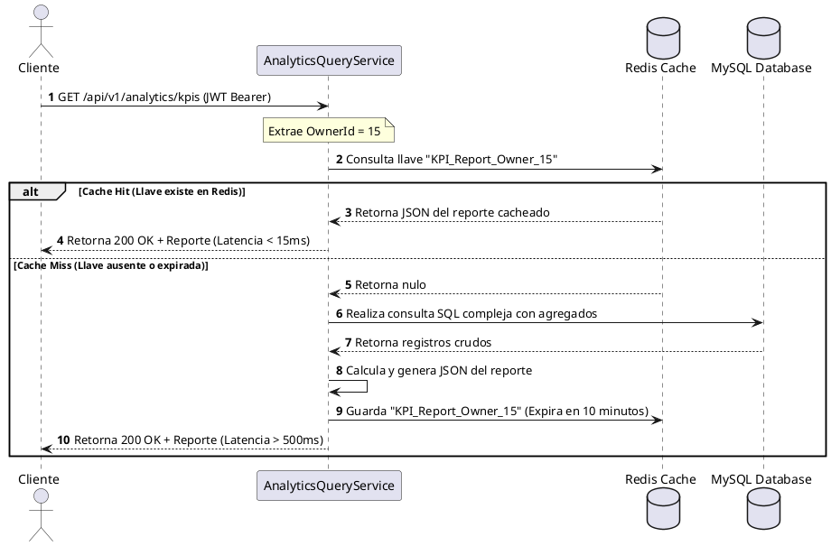

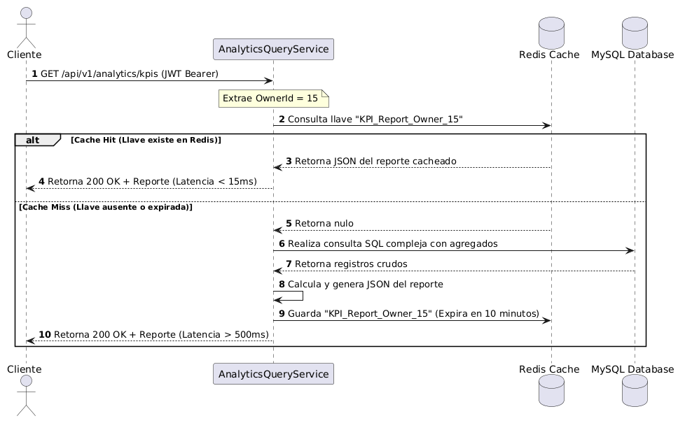

