# Diagramas de Arquitectura Vintara - C4, UML & Vistas

Este documento contiene los diagramas arquitectónicos del backend de **Vintara (WineSoft)** modelados en **PlantUML**. Puede visualizarlos usando la extensión de PlantUML en VS Code (presionando Alt+D en el bloque de código) o copiando el código en el servidor oficial de PlantUML.

---

## 1. C4 Context Diagram

```plantuml
@startuml
!include https://raw.githubusercontent.com/plantuml-stdlib/C4-PlantUML/master/C4_Context.puml

LAYOUT_WITH_LEGEND()

title C4 Context Diagram - Plataforma WineSoft

Person(owner, "Dueño de Negocio (Owner)", "Administra la bodega, inventario y visualiza reportes analíticos.")
Person(operator, "Operador (Operator)", "Registra movimientos de stock e interactúa con alertas en tiempo real.")

System(winesoft, "Plataforma WineSoft", "Sistema centralizado para gestión de inventarios, alertas IoT, analítica de datos y perfiles.")
System(iot_simulator, "Servidor de Simulación IoT", "Genera lecturas simuladas de telemetría (temperatura, humedad, presión, nivel) y las envía al sistema.")

Rel(owner, winesoft, "Visualiza reportes, gestiona inventario y perfiles", "HTTPS")
Rel(operator, winesoft, "Registra stock, gestiona alertas", "HTTPS")
Rel(iot_simulator, winesoft, "Envía telemetría de sensores en tiempo real", "HTTP / REST")

@enduml
```


---

## 2. C4 Container Diagram

```plantuml
@startuml
!include https://raw.githubusercontent.com/plantuml-stdlib/C4-PlantUML/master/C4_Container.puml

LAYOUT_WITH_LEGEND()

title C4 Container Diagram - Plataforma WineSoft

Person(owner, "Dueño de Negocio (Owner)")
Person(operator, "Operador (Operator)")

System_Boundary(winesoft_system, "Límites del Sistema WineSoft") {
    Container(web_app, "Aplicación Web (SPA)", "Vue.js 3, Vite, Pinia", "Interfaz de usuario para interactuar con todas las funcionalidades del sistema.")
    Container(gateway, "API Gateway", "ASP.NET Core, YARP", "Punto de entrada único. Enruta peticiones HTTP hacia los microservicios correspondientes.")
    
    Container(auth_service, "AuthService", "ASP.NET Core, C#", "Maneja autenticación, registro de usuarios, contraseñas y generación de JWT.")
    Container(inventory_service, "InventoryService", "ASP.NET Core, C#", "Gestiona suministros, transacciones de stock, alertas de sensores y lógica de AlertEngine.")
    Container(profiles_service, "ProfilesService", "ASP.NET Core, C#", "Gestiona los perfiles fiscales y empresariales vinculados a los usuarios.")
    Container(analytics_service, "AnalyticsService", "ASP.NET Core, C#", "Gestiona reportes analíticos de rotación, niveles de stock y alertas.")
    
    ContainerDb(mysql_db, "Base de Datos Relacional (MySQL)", "MySQL 8.0", "Almacena datos persistentes en esquemas separados para cada microservicio.")
    ContainerDb(redis_cache, "Caché Distribuido (Redis)", "Redis", "Almacena en caché consultas analíticas frecuentes de inventario.")
    Container(rabbitmq, "Message Broker (RabbitMQ)", "RabbitMQ", "Canal de mensajería asíncrona mediante eventos usando MassTransit.")
}

System(iot_simulator, "Servicio Simulador IoT", "ASP.NET Core Worker", "Genera simulaciones continuas y envía telemetría directamente a los servicios internos.")

Rel(owner, web_app, "Usa", "HTTPS")
Rel(operator, web_app, "Usa", "HTTPS")

Rel(web_app, gateway, "Peticiones de API", "HTTPS / JSON")

Rel(gateway, auth_service, "Enruta /api/auth", "HTTP / JSON")
Rel(gateway, inventory_service, "Enruta /api/inventory", "HTTP / JSON")
Rel(gateway, profiles_service, "Enruta /api/profiles", "HTTP / JSON")
Rel(gateway, analytics_service, "Enruta /api/analytics", "HTTP / JSON")

Rel(auth_service, mysql_db, "Lee/Escribe usuarios", "EF Core / TCP")
Rel(profiles_service, mysql_db, "Lee/Escribe perfiles", "EF Core / TCP")
Rel(inventory_service, mysql_db, "Lee/Escribe suministros y alertas", "EF Core / TCP")

Rel(iot_simulator, auth_service, "Solicita token de servicio", "HTTP / JSON")
Rel(iot_simulator, inventory_service, "Registra telemetría", "HTTP / JSON")

Rel(inventory_service, rabbitmq, "Publica eventos (SupplyStockChanged)", "AMQP / MassTransit")
Rel(rabbitmq, analytics_service, "Consume eventos (SupplyStockChanged)", "AMQP / MassTransit")

Rel(analytics_service, redis_cache, "Consulta/Guarda reportes", "StackExchange.Redis")
Rel(analytics_service, inventory_service, "Consulta datos históricos de inventario", "HTTP / JSON")

@enduml
```

![UML Diagram](http://www.plantuml.com/plantuml/png/~1bLPDRzj64BthLqpL2mKeKe7cKFGKML8T1_vWJ3b6Ji9eEP8sNkuo-s5NBVg3Sl0XoArN_R5Ybg8-QIIzBMTs7X_Vphpb6-VH-b2erazI2nLoWgNtfVkztxVur5j8lmopuCWAeprftnEcw9SADTUySZvNSjOVldwLSkZkwh9VeFDa-yFNqw7H7gKcsoiPltKv-7XpDvdUNqpUJY_7v-FhKT9fjRpqYc3u6hRROIHnOR60Lv0gz3Wtja2ubveoC_UjLahM6PsO9qss2-rHeFLN0pd1DIsCa0QI6qvrsftjrf8iUiExRtYP6mj9N7aJzxMobVDKJCzCq3dQLV8aDJapzrCN4rreNwwV2-d9GKuACidH7Qbs1_vk0S3k8v8dcasnBBlG7fHA2XHo_Kt3FSqWoT91fzs5zeT0lKyEVkt21-cf2wdK4ZbneJtPEVx57nLSG2iDb6WH92TG-80MXD7WJOuE53gO1osaqQXaZlc6fQjOzjgT8suBzFI4A-QMNi1vzSGl7cHfxteyWQ6nr8MFWzkKesdGFWfCsblC4TR_QYbC3yRQ1ezGafVySdBmTZ99OOb28YZZe9326aVsaVCEXB6MN6bqBabxSZMp8teO_79QLH6J2dwPLK-d78S_S-mADNr2mC0jMelT1KiBwRmrUpgwBWldBJfQVqK7ArYGPatZyUG4x-udfu99_KZQ6xlQetLHnxx3xPoSvvC15mgf8n_N1MzHEnGRsN82vuruw08giXwh26bdB357jVwsa08vEk0DOxsGcavvbjRCfIAtHpFTX7wK9HzRIJRMm5mwWRnO0HMb9OTMnkT7gKLGc1i7LKajxoadrAXMNefzKeCwzgEiB9N6ylGnslhPIs6YHjRu-h2rV2IrfoMiQZ6RssmqIugL-woc-QmBxJDqnAKZzCR1BIcinWcIgrNs_ZBEQrp1RxrV8brLe22DaCUAacmSDsvh80taFWSgq84ZdbmMAawmuFav68iJnKQpn58ktLIWMB9QGnJBzHSOSU_8MP2vWUIMTqHMSNN0Y3HmwVeBjxeBYljfgnjxXIKHAgOvGTNRV7YdPsTnDfE--CmVJyxXWk3CcWUoaDp6rDNxYiFcWTT3VXK35wGTVYAxVaP0jtxMml9H5fHBr9w0ulnmww3E3LoXSnEU2kcPo3-rAIVI-AcJHL0R2wzwHXh8Of3D_C9CZbi8xerz85jr4KyuL1YRYMCJa3f41o3zo1mzAIh8Hxwvj2Gy5gpIfiDtDXPTM5UzthebLLz5Eyk_Sz77sGspTgVQixs3NjmMzsspEvDET_xA1f1UR8kW3--oc-kwTbjovA0Rd-vZAVkSgkjtvGVLJMwt3x7DVmUdmOtsOUhqTr2Q_EFWW-hyAKu4EjHYR-GlYVfZ9woSxMu7nXZ_KJLG7oR3TCFcz5DU0AgjyoMW1crVGDgxBdPMrWHRuHuEoL43P4P98Js2DmyKhxcwcvl5Fq9hQeZRwcuz69iNJg2XVCzOqZ3Z_wEj7IHPA4krojZ3XqlK2ygZnmoktZFmdarioEwmcbfbo1POxDpcVy5N3NIAUkJF6vVjdmUq-UwoOjZCetWO_odYctgLLrUq6s2RTAx1D_VCKZg__cRh-szdtWtQlo6TXqBz1m==)


---

## 3. C4 Component Diagrams

### A. GatewayService
```plantuml
@startuml
!include https://raw.githubusercontent.com/plantuml-stdlib/C4-PlantUML/master/C4_Component.puml

title C4 Component Diagram - GatewayService

Container(web_app, "Aplicación Web (SPA)", "Vue.js", "Envía solicitudes HTTPS")

Container_Boundary(gateway_boundary, "GatewayService") {
    Component(program, "Program.cs", "ASP.NET Core", "Punto de entrada, arranca el pipeline de ASP.NET y configura los servicios.")
    Component(yarp, "YARP Middleware", "Microsoft.AspNetCore.ReverseProxy", "Carga la configuración de rutas y enruta las peticiones de forma dinámica.")
    Component(cors_policy, "CORS Middleware", "ASP.NET Core CORS", "Valida los orígenes permitidos (localhost, Render, Vercel).")
    Component(appsettings, "appsettings.json", "JSON Config", "Contiene las definiciones de rutas, clústeres y destinos de YARP.")
}

Container(auth_service, "AuthService", "REST API")
Container(inventory_service, "InventoryService", "REST API")
Container(profiles_service, "ProfilesService", "REST API")
Container(analytics_service, "AnalyticsService", "REST API")

Rel(web_app, cors_policy, "Llamadas HTTP", "HTTPS")
Rel(cors_policy, yarp, "Petición autorizada")
Rel(program, yarp, "Configura enrutamiento")
Rel(program, appsettings, "Lee configuraciones")

Rel(yarp, auth_service, "Enruta /api/auth", "HTTP")
Rel(yarp, inventory_service, "Enruta /api/inventory", "HTTP")
Rel(yarp, profiles_service, "Enruta /api/profiles", "HTTP")
Rel(yarp, analytics_service, "Enruta /api/analytics", "HTTP")

@enduml
```


### B. AuthService
```plantuml
@startuml
!include https://raw.githubusercontent.com/plantuml-stdlib/C4-PlantUML/master/C4_Component.puml

title C4 Component Diagram - AuthService

Container(gateway, "API Gateway", "YARP")
ContainerDb(mysql_db, "Base de Datos", "MySQL")

Container_Boundary(auth_boundary, "AuthService") {
    Component(auth_controller, "AuthController", "REST Controller", "Expone endpoints para login, registro de usuarios, cambio de contraseña y generación de tokens de servicio.")
    Component(auth_query_svc, "AuthQueryService", "Application Query Service", "Procesa consultas de autenticación y encapsula la generación de tokens JWT.")
    Component(auth_cmd_svc, "AuthCommandService", "Application Command Service", "Procesa comandos de registro de usuarios y actualización de datos con encriptación BCrypt.")
    Component(user_repo, "UserRepository", "Infrastructure Repository", "Gestiona la persistencia de la entidad User.")
    Component(auth_db_context, "AuthDbContext", "EF Core DbContext", "Configuración de persistencia para las tablas de autenticación.")
    Component(user_entity, "User", "Domain Model", "Entidad de dominio que representa a los usuarios del sistema.")
}

Rel(gateway, auth_controller, "Solicitudes /api/auth", "HTTP")
Rel(auth_controller, auth_query_svc, "Llama")
Rel(auth_controller, auth_cmd_svc, "Llama")
Rel(auth_query_svc, user_repo, "Busca usuario")
Rel(auth_cmd_svc, user_repo, "Guarda usuario")
Rel(user_repo, auth_db_context, "Usa")
Rel(auth_db_context, user_entity, "Mapea")
Rel(auth_db_context, mysql_db, "Lee/Escribe en winesoft_auth", "TCP/IP")

@enduml
```


### C. InventoryService
```plantuml
@startuml
!include https://raw.githubusercontent.com/plantuml-stdlib/C4-PlantUML/master/C4_Component.puml

title C4 Component Diagram - InventoryService

Container(gateway, "API Gateway", "YARP")
Container(rabbitmq, "Message Broker", "RabbitMQ")
ContainerDb(mysql_db, "Base de Datos", "MySQL")

Container_Boundary(inventory_boundary, "InventoryService") {
    Component(supplies_ctrl, "SuppliesController", "REST Controller", "Expone CRUD de suministros.")
    Component(movements_ctrl, "StockMovementsController", "REST Controller", "Expone registro e historial de movimientos de stock.")
    Component(alerts_ctrl, "SensorAlertsController", "REST Controller", "Recibe telemetría IoT y expone alertas.")
    
    Component(supply_cmd_svc, "SupplyCommandService", "Command Service", "Maneja creación, actualización y eliminación de suministros.")
    Component(movement_cmd_svc, "StockMovementCommandService", "Command Service", "Registra movimientos y actualiza el stock disponible.")
    Component(alert_cmd_svc, "SensorAlertCommandService", "Command Service", "Procesa la ingesta de telemetría.")
    
    Component(supply_query_svc, "SupplyQueryService", "Query Service", "Consultas de suministros validadas por OwnerId.")
    Component(movement_query_svc, "StockMovementQueryService", "Query Service", "Historial de transacciones de stock.")
    Component(alert_query_svc, "SensorAlertQueryService", "Query Service", "Consultas paginadas de alertas IoT.")
    
    Component(alert_engine, "AlertEngine", "Domain Service", "Clasifica lecturas de sensores (NORMAL, WARNING, CRITICAL) y detecta anomalías.")
    Component(inv_subject, "InventorySubject", "Domain Event Publisher", "Notifica a observadores locales y publica eventos a RabbitMQ.")
    
    Component(supply_repo, "SupplyRepository", "Infrastructure Repository", "Persistencia de Supply.")
    Component(movement_repo, "StockMovementRepository", "Infrastructure Repository", "Persistencia de StockMovement.")
    Component(alert_repo, "SensorAlertRepository", "Infrastructure Repository", "Persistencia de SensorAlert.")
    
    Component(inv_db_context, "InventoryDbContext", "EF Core DbContext", "Acceso a tablas de inventario en MySQL.")
}

Rel(gateway, supplies_ctrl, "HTTP /api/inventory/supplies")
Rel(gateway, movements_ctrl, "HTTP /api/inventory/stockmovements")
Rel(gateway, alerts_ctrl, "HTTP /api/inventory/sensoralerts")

Rel(supplies_ctrl, supply_cmd_svc, "Usa")
Rel(supplies_ctrl, supply_query_svc, "Usa")
Rel(movements_ctrl, movement_cmd_svc, "Usa")
Rel(movements_ctrl, movement_query_svc, "Usa")
Rel(alerts_ctrl, alert_cmd_svc, "Usa")
Rel(alerts_ctrl, alert_query_svc, "Usa")

Rel(supply_cmd_svc, supply_repo, "Usa")
Rel(supply_cmd_svc, inv_subject, "Notifica cambios de stock")
Rel(movement_cmd_svc, movement_repo, "Usa")
Rel(movement_cmd_svc, supply_repo, "Actualiza stock")
Rel(movement_cmd_svc, inv_subject, "Notifica cambios")
Rel(alert_cmd_svc, inv_subject, "Notifica lectura de sensor")

Rel(supply_query_svc, supply_repo, "Usa")
Rel(movement_query_svc, movement_repo, "Usa")
Rel(alert_query_svc, alert_repo, "Usa")

Rel(inv_subject, alert_engine, "Llama OnSensorReadingReceivedAsync / OnSupplyStockChangedAsync")
Rel(inv_subject, rabbitmq, "Publica SupplyStockChanged", "MassTransit")

Rel(alert_engine, alert_repo, "Guarda alerta generada")

Rel(supply_repo, inv_db_context, "Usa")
Rel(movement_repo, inv_db_context, "Usa")
Rel(alert_repo, inv_db_context, "Usa")

Rel(inv_db_context, mysql_db, "Persiste en winesoft_inventory", "TCP/IP")

@endif
```

![UML Diagram](http://www.plantuml.com/plantuml/png/~1fLVDSkCs3BxxAL2TuXadkkJKqpfoclLCd3YACvsUF125EDobI8MadAYTFjAUzX7oOXrAiaN9V-diaII8xyC72A2-68lQ5faO_COb4qLAy69jRduFGurl5ojkNugaCAIPafQalM0g2tE1qjqvDpOLF0cZo_EvstgQtOOP6aiwZ2wNaSfo9TsTtFaVM6u5GNG9smEOS5nfpE0Sfd9DqYfTFf9USqQ3GQIaHIv9dwtGqXkM8mZ6yodSrAjW1C5VutWU33rBZKd2RVOwWc16nk2Au4ghxwITTLmTpXxy6vFaB2lDgrYcoGY2ApG4AS44hJBkognyVBWDXXwPvPKgP8gwFECRnikasHf1q0yZ6C8_0m1eOpupHPuBJcR9h1OZ21wRjOFGIeY6xFNZ0hfRr-_E0qJnqyIHD4N69JTMAtCH37iWcLfJHjAsA5QnxxFDxcUnDAqg121uuSOgpL4ux4ojUSPTfAQYufplaa11scD0qYWzhlPEuiV4U49WIL16Ld_yG9Yg1PH0DR7ADMu3toTnkMHPkZHhjj6uZ5IMeKmtgHb1qEo0jpL3ITyGc2Pa_EEd704oMw3WVzThnq7mZCjc-TbC-6pyN7oAL5pd0Jl2boqp854d0L9kSYLv8kX0FdmURKO-nMAk5IE3812uN96nwABtSdGy7Qy5wRAJa0Utum5KQnynKj8KmgBfoGnh53p550taIiFzcoGzJO-8ty7svJz9uQjVzrQZDCWOLv9ELduNjDNwVqITuuhBAinqM_FkGpWWT0rBSiKbkMxfbjVLohcTg0ovx009DFoPCmH1p1QwqRcYIWRExkxZsVXs17-EuxlftSq8edYwc4RZso6Ka98bPX5GgWp5nu_sQsm9SRbUcYBvHinsccEzvP6wTYSmBnB1pKlT0kwKhRaXgCIGNcDQiHAAeI1N_hapPmXKkJM0i6dnnmjHKwwsDHXJhWnth1peL3vhD5ONJWw2xk6SjE76acIyglpQmP6gsm3v1VShUBwVGqMtmMphxLSGMoy797KPJfDbzJfuxoHvahYMJkzLcg__W4XfWixcc34o2X0i9gAklNgeekOAI48rVXtmluD1JA9z2FHdwDV5OWuXvZpSJkLmOnCCktTtHkFUoqxghMNVHNUmxRrV2LVRkVU3kzuZlJEadWmsGFij_NRIslR3sJDlFc6yttSdplxqE6gswwyDp8kv-q7s1F3ikdrasnaOPWdtdY2zADlx_IzoLv53dCRR4NiSuJX3NwYJTvfUtBRYddgUjeVqsvVNmnhifApJIRpqTGZtXisjm0pXNjOj8oPCkLp5n8YlAHsRKZ88tN75kEfaqGlALNFMCEa0U8_vQZ0mXDtRzPFDc8MRpDnkc6A7N2UUcm9rYiqqXHL9qfZsAxIstMbkUnG-QUc37p3RnkwVUVybcxRiUk8RbsJKirrkcusJO17Dmwdx5nfy8Pdov_y0)


### D. ProfilesService
```plantuml
@startuml
!include https://raw.githubusercontent.com/plantuml-stdlib/C4-PlantUML/master/C4_Component.puml

title C4 Component Diagram - ProfilesService

Container(gateway, "API Gateway", "YARP")
ContainerDb(mysql_db, "Base de Datos", "MySQL")

Container_Boundary(profiles_boundary, "ProfilesService") {
    Component(profiles_ctrl, "ProfilesController", "REST Controller", "Endpoints para gestionar perfiles fiscales de negocio.")
    Component(profile_cmd_svc, "ProfileCommandService", "Command Service", "Procesa creación y modificación de perfiles de negocio.")
    Component(profile_query_svc, "ProfileQueryService", "Query Service", "Recupera datos de perfiles por ID u Owner.")
    Component(profile_facade, "ProfilesContextFacade", "Anti-Corruption Layer (ACL)", "Facade pública para exponer los perfiles a otros contextos si es requerido.")
    Component(profile_repo, "ProfileRepository", "Infrastructure Repository", "Persistencia de perfiles de negocio.")
    Component(profiles_db_context, "ProfilesDbContext", "EF Core DbContext", "Configuración de base de datos de perfiles.")
}

Rel(gateway, profiles_ctrl, "HTTP /api/profiles")
Rel(profiles_ctrl, profile_cmd_svc, "Usa")
Rel(profiles_ctrl, profile_query_svc, "Usa")
Rel(profile_facade, profile_query_svc, "Usa")
Rel(profile_cmd_svc, profile_repo, "Usa")
Rel(profile_query_svc, profile_repo, "Usa")
Rel(profile_repo, profiles_db_context, "Usa")
Rel(profiles_db_context, mysql_db, "Persiste en winesoft_profiles", "TCP/IP")

@enduml
```


### E. AnalyticsService
```plantuml
@startuml
!include https://raw.githubusercontent.com/plantuml-stdlib/C4-PlantUML/master/C4_Component.puml

title C4 Component Diagram - AnalyticsService

Container(gateway, "API Gateway", "YARP")
Container(rabbitmq, "Message Broker", "RabbitMQ")
ContainerDb(redis_cache, "Caché", "Redis")
Container(inventory_service, "InventoryService", "REST API")

Container_Boundary(analytics_boundary, "AnalyticsService") {
    Component(analytics_ctrl, "AnalyticsController", "REST Controller", "Expone endpoints para reportes, alertas de bajo stock y rotación.")
    Component(analytics_cmd_svc, "AnalyticsCommandService", "Command Service", "Genera solicitudes de análisis.")
    Component(analytics_query_svc, "AnalyticsQueryService", "Query Service", "Calcula métricas analíticas e integra caché Redis.")
    Component(stock_consumer, "SupplyStockChangedConsumer", "MassTransit Consumer", "Escucha variaciones de stock desde RabbitMQ para invalidar reportes.")
    Component(pdf_builder, "QuestPdfAnalyticsReportBuilder", "Infrastructure Service", "Renderiza reportes en formato PDF.")
    Component(cache_svc, "AnalyticsCacheService", "Infrastructure Service", "Abstracción sobre IDistributedCache para interactuar con Redis.")
    Component(srv_clients, "ServiceClients", "HTTP Client Service", "Consulta datos directamente al microservicio de inventario.")
    Component(analytics_repo, "AnalyticsRepository", "Infrastructure Repository", "Maneja datos analíticos locales si existen.")
}

Rel(gateway, analytics_ctrl, "HTTP /api/analytics")
Rel(gateway, analytics_ctrl, "HTTP /api/analytics")
Rel(analytics_ctrl, analytics_query_svc, "Usa")
Rel(analytics_ctrl, analytics_cmd_svc, "Usa")

Rel(analytics_query_svc, cache_svc, "Verifica caché")
Rel(analytics_query_svc, srv_clients, "Consulta suministros e historial")
Rel(analytics_query_svc, pdf_builder, "Llama para generar PDF")

Rel(stock_consumer, cache_svc, "Invalida caché al ocurrir cambios de stock")
Rel(rabbitmq, stock_consumer, "Despacha evento", "AMQP")

Rel(srv_clients, inventory_service, "Llamadas HTTP internas", "HTTP / JSON")
Rel(cache_svc, redis_cache, "Almacena/Recupera JSON", "TCP")

@enduml
```

![UML Diagram](http://www.plantuml.com/plantuml/png/~1dLMzRYD73Exr5CnMDY1RZQjK9ylEHS4faMLVW5G2TuQMU3SxiyVXwau9yZ0fNQJA8-Z5WfdLpygo7I3TBeS_7ycFvBkeADfKhlSTU-CQIx1KhUFtWu7Wryi5wx8fcqXYWbVoUcb2DQWT-cHp4TKwBWUZgujf4dsSV1XK69LaCBgQZq9L1vziwkI_fwoEO7G5-mUuOLm8Ld01GuzkhMpYFScA3VLwe-0LsPESBL3fAwxxK0odOtZV_XLzA7uRpgR5UKTJi2nPgozzA2OK8ou8hYLy9adQi_mukUjQt9HdGfRZtA1PKX-A4PhbvYch9_cHT_OhyXfaFOyjo3uKuvriYpjRtju_m70wBiuxMSolG-CjoleCTwdEowqePVOi_-8S_kW1mA5O7JkZuhesAOW4vxPvfl37ejjloGUGjtLWhn5g50IXEeXIx0Cw4iK8bg34Jm6Y1lCPrY11qV3c7tzPdB-EfhBpk3B7WAeAlUtKP2k1ZkWzUHA461mRriPIZez-yvVZoF6ja5yQIbqu3dgNX1t_-RyRS8JED0wXsZofiC48oUFcRytV1EoL5eAGkB1vWao0KnIvDdCJV6mgaZuKzqrTk_Lz4e-Mw1TaHzl757I2CJu8-iWANVbjD8rP8gnG60q7twRVLjvIj0GxmhRTOhz2nnPbtxTJRBLzd9SDEvk1tJKKTMeVznMQPSFhLY616Fj7mQZI66s4khMQaRSa_Fk19K0U7eDKg06cDp-S1iyZTCA49EpuVJtYi8mgQ3BT88PI2COt75MuR9HiThIhX9AWqGO5JF2lDafMS-EOlCRKfJRIg1MaW3y-F4oX_JzYIMgIKmIB6Y9O5ZAA5NabG0SL6mdj_7D87Mkt0Wg7jnYRgjYjIsf5vBGuNgZAyUC4FNtQmTapDaHmmQ2Z2961ld5KocFwPwyt8tTOcYTh8-Szm9e7-wVY_7_RF5TzUKW_HlnF_SCUQRMVgNVSTPdsAma_ijbDxKcKZjan8VPzZat5FX4jf2MmvAX16DrRdexdx8F32bjgBl9EapGWkmoUxuik-F5sfdSh1nq4quYmWC6gvCI_xKxOmZbSk9CzT4EnnhHIA9-aF5EJktGWMnpTx5ywPJaDYn5oi_EGUJnCoW1-kl_bvosCJXB7ztFeAZJaSJ0ZqzHflsUhFXGFempb7NdRLEvV)


### F. IoTSimulatorService
```plantuml
@startuml
!include https://raw.githubusercontent.com/plantuml-stdlib/C4-PlantUML/master/C4_Component.puml

title C4 Component Diagram - IoTSimulatorService

Container(auth_service, "AuthService", "REST API")
Container(inventory_service, "InventoryService", "REST API")

Container_Boundary(iot_boundary, "IoTSimulatorService") {
    Component(sim_engine, "SimulationEngine", "IHostedService", "Hilo de fondo que inicializa el bucle de simulación e interactúa con APIs externas.")
    Component(sim_factory, "DeviceSimulatorFactory", "Factory Pattern", "Crea instancias de simuladores según el tipo de lectura.")
    Component(base_sim, "BaseDeviceSimulator", "Base Class", "Implementa comportamiento común para las caminatas aleatorias.")
    Component(concrete_sims, "ConcreteSensorSimulators", "Simulators", "Implementa algoritmos específicos para temperatura, humedad, presión y nivel.")
}

Rel(sim_engine, auth_service, "Petición de token de servicio", "HTTP POST")
Rel(sim_engine, sim_factory, "Solicita simulador")
Rel(sim_factory, concrete_sims, "Instancia")
Rel(concrete_sims, base_sim, "Hereda de")
Rel(sim_engine, concrete_sims, "Ejecuta paso de simulación")
Rel(sim_engine, inventory_service, "Envía telemetría generada", "HTTP POST")

@enduml
```


---

## 4. C4 Code Diagrams (Diagramas de Clase UML)

### A. AuthService
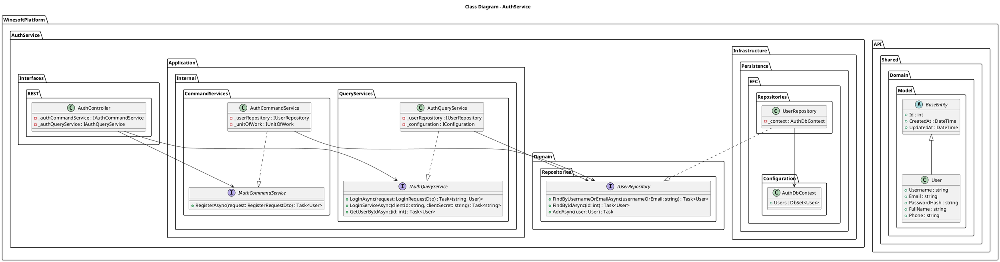


### B. InventoryService
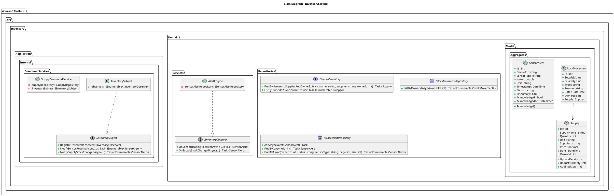


### C. ProfilesService
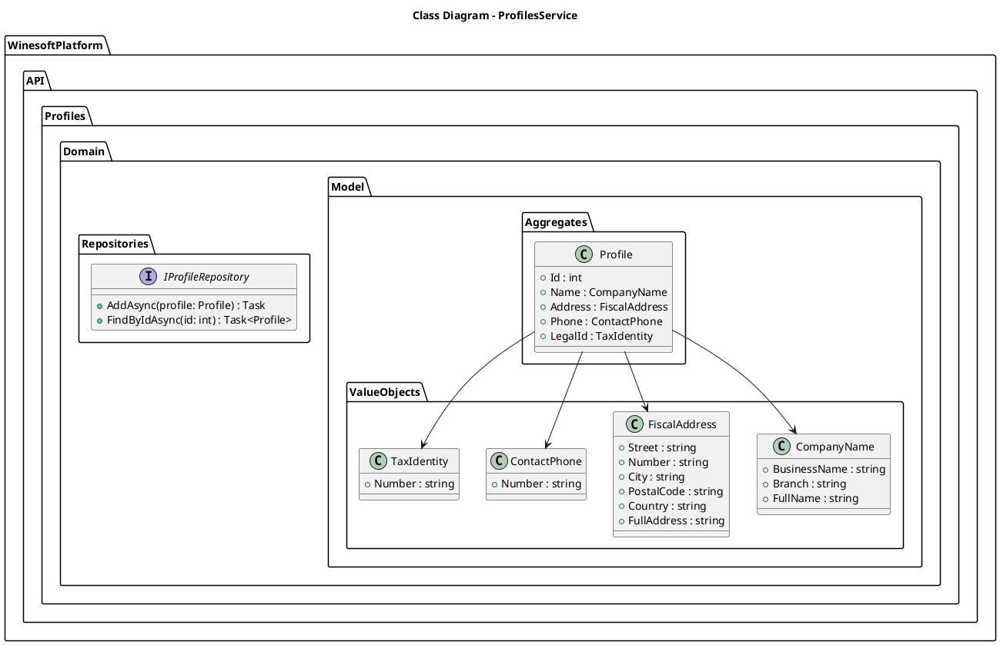


### D. AnalyticsService
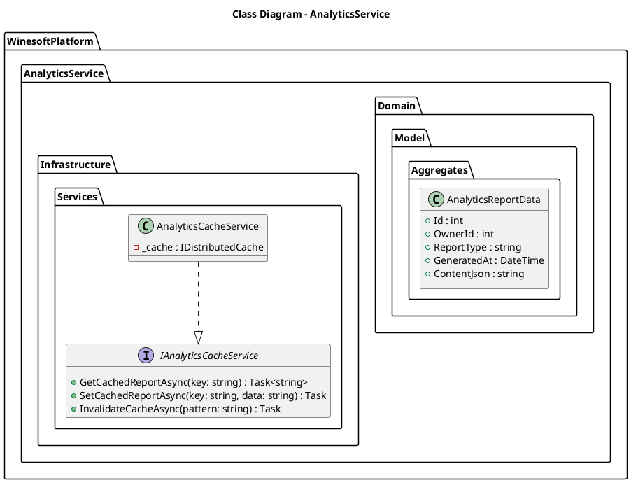


### E. IoTSimulatorService
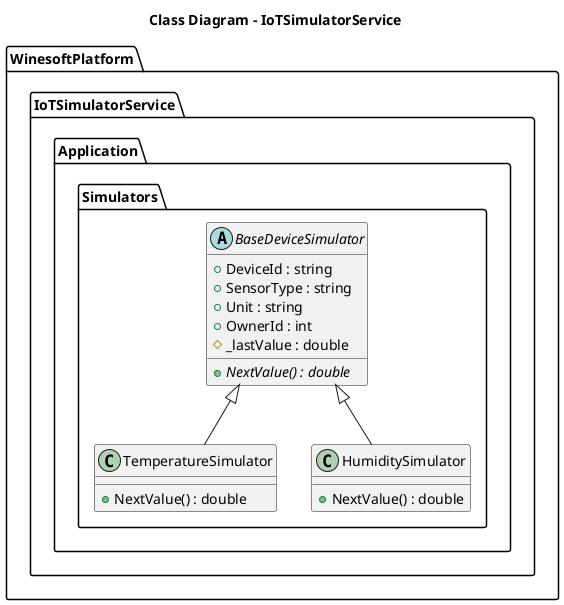


---

## 5. Vista Lógica

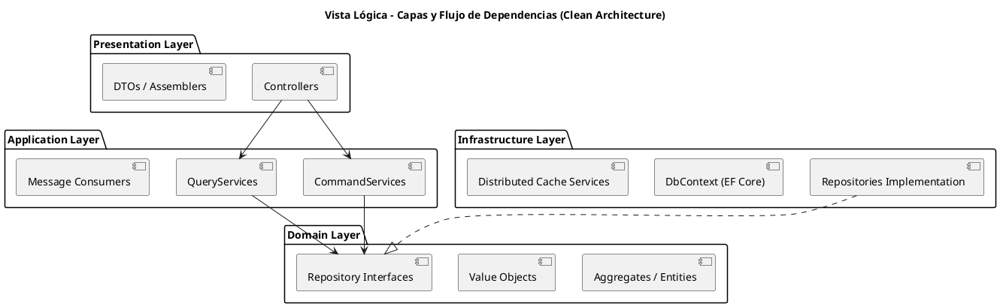


---

## 6. Vista de Comportamiento (Diagramas de Secuencia)

### A. Inicio de Sesión
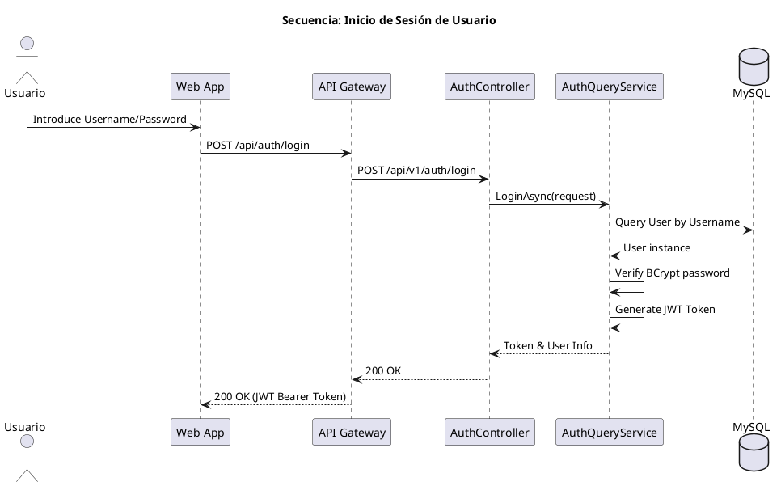


### B. Registro de Movimiento de Stock
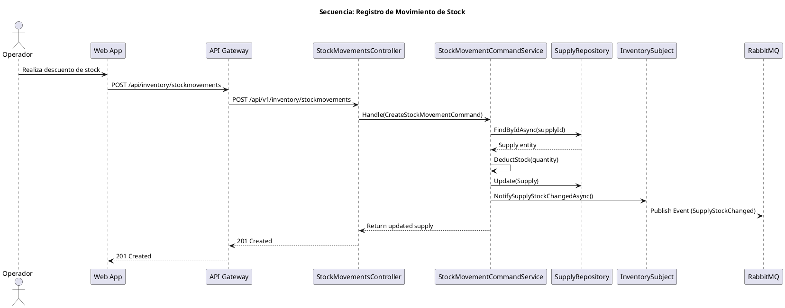


---

## 7. Vista Física

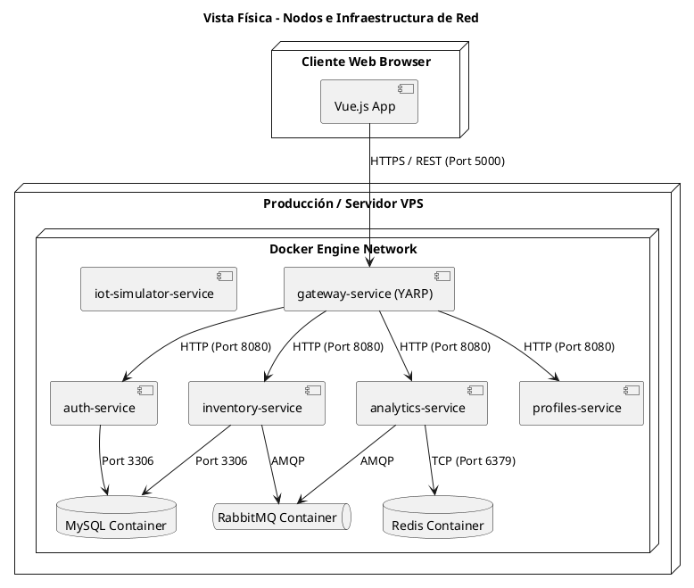


---

## 8. Vista Modular

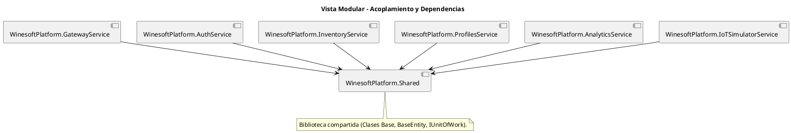


---

## 9. Vista de Despliegue

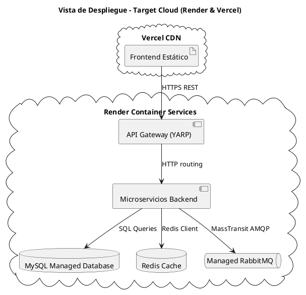


---

## 10. Modelo de Datos (Diagrama ER)

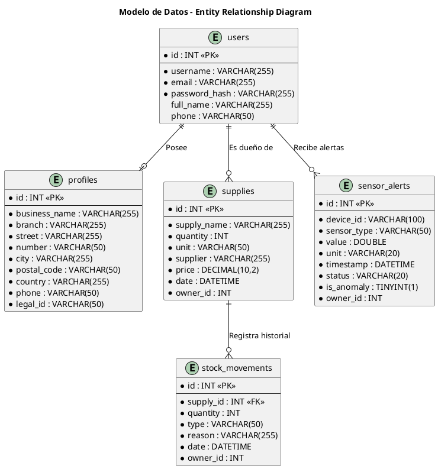


