# Diagramas de Arquitectura Vintara - Mermaid Format

Este documento contiene los diagramas arquitectónicos del backend de **Vintara (WineSoft)** modelados con **Mermaid**. 
Mermaid se renderiza de forma nativa en GitHub, GitLab y en VS Code (usando la vista de vista previa de Markdown).

---

## 1. C4 Context Diagram

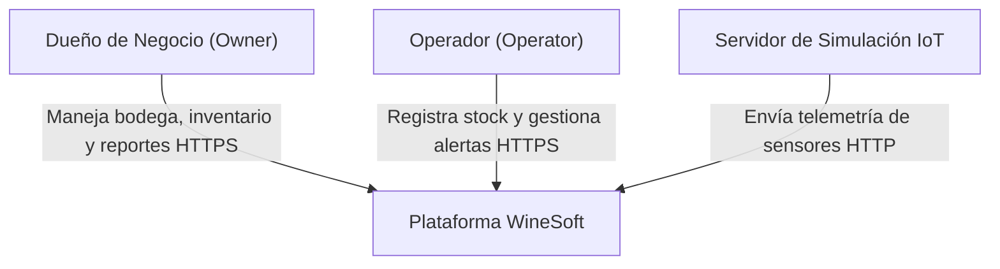

---

## 2. C4 Container Diagram

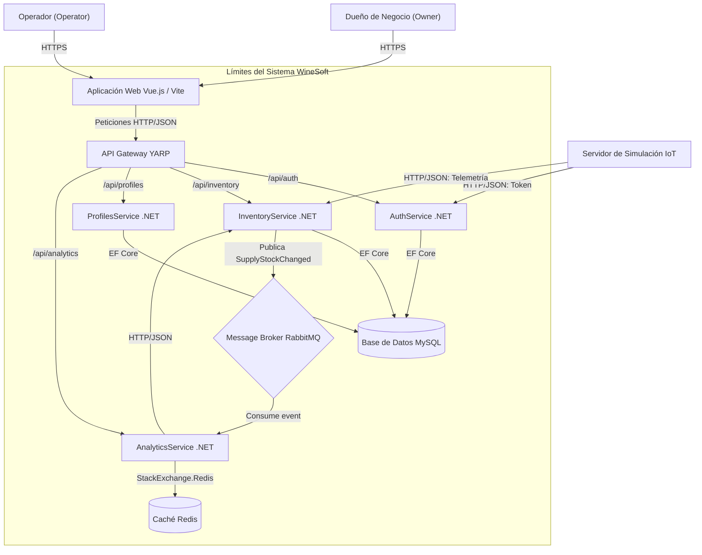

---

## 3. C4 Component Diagrams

### A. GatewayService
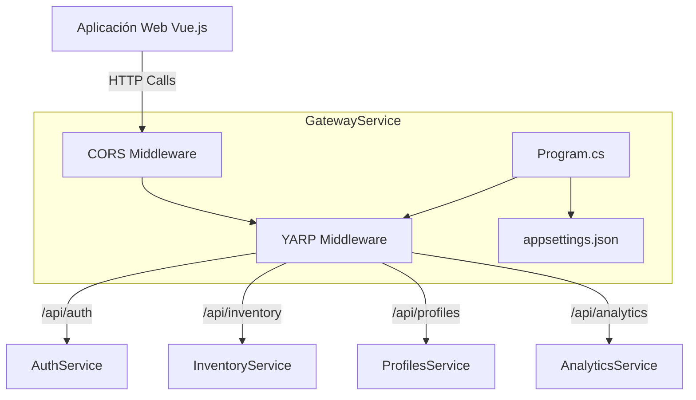

### B. AuthService
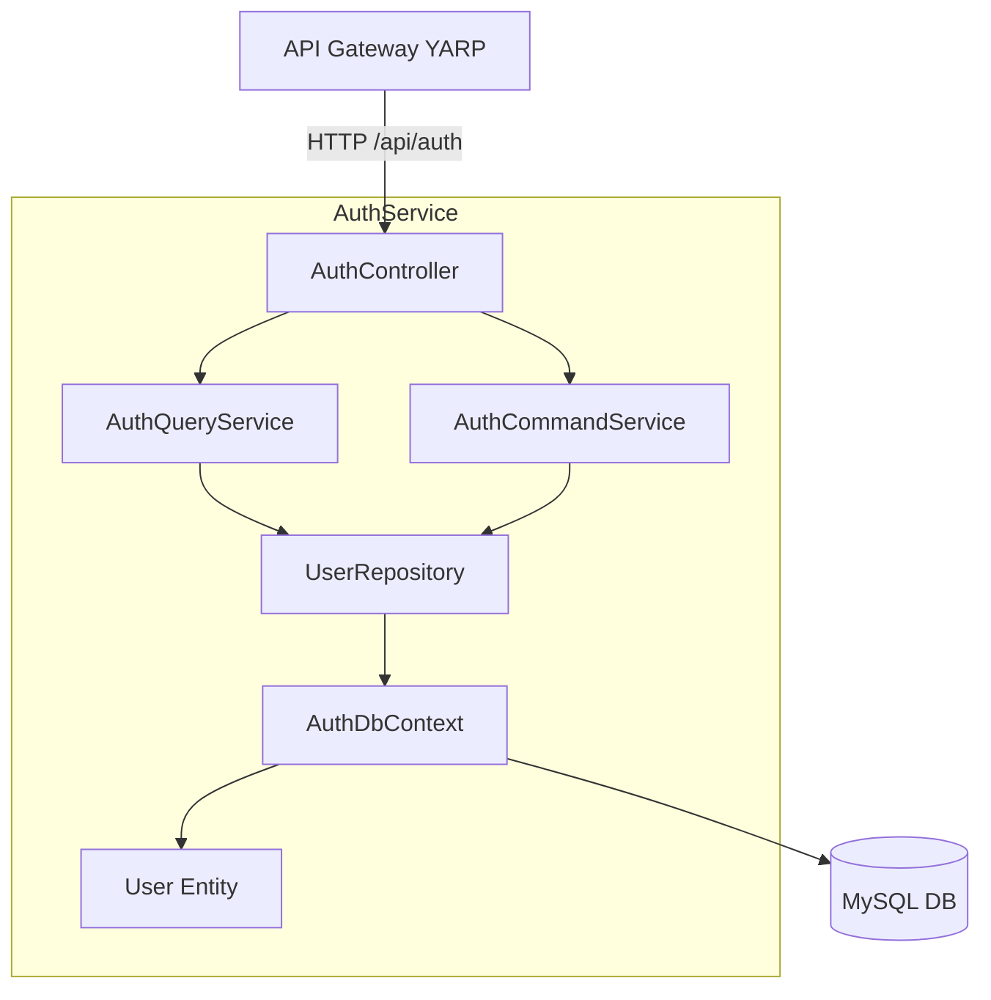

### C. InventoryService
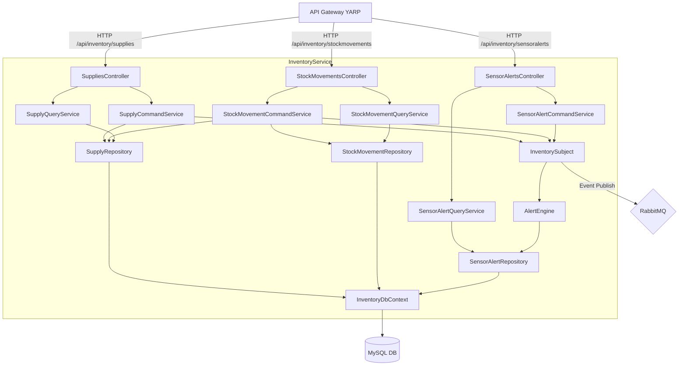

### D. ProfilesService
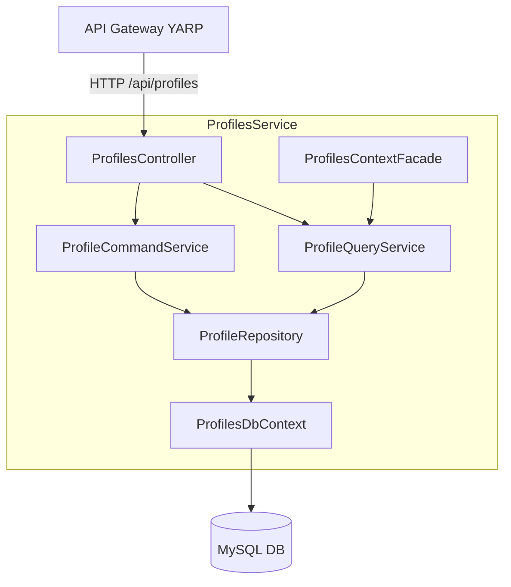

### E. AnalyticsService
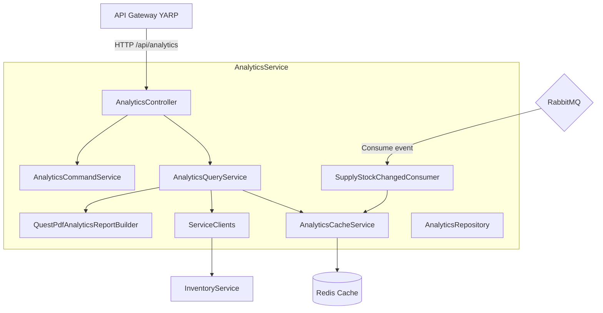

### F. IoTSimulatorService
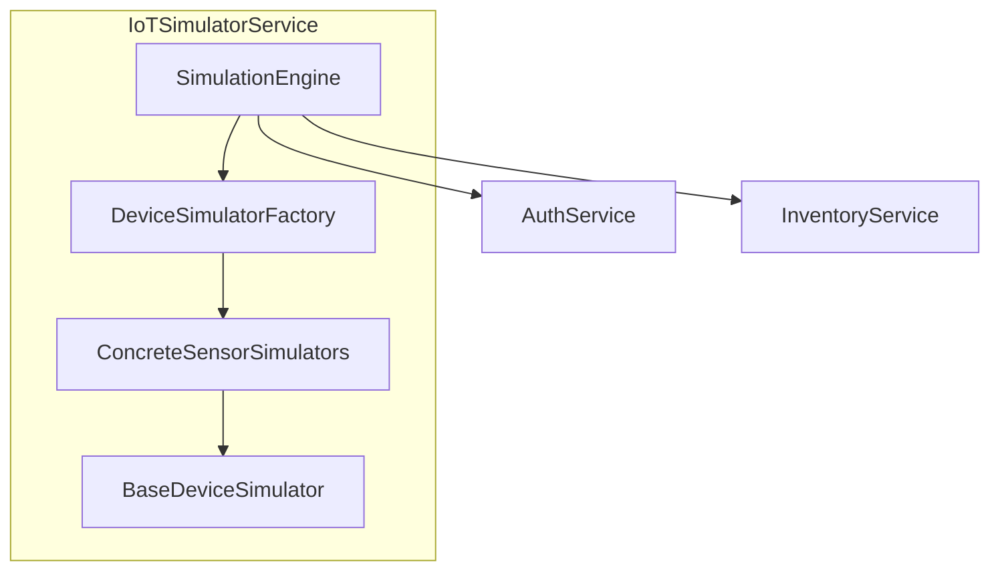

---

## 4. Vista Lógica

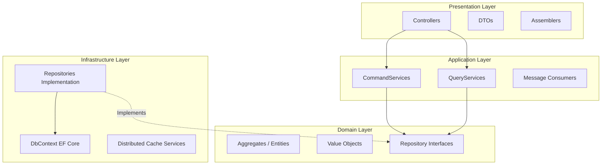

---

## 5. Vista de Comportamiento (Diagramas de Secuencia)

### A. Inicio de Sesión
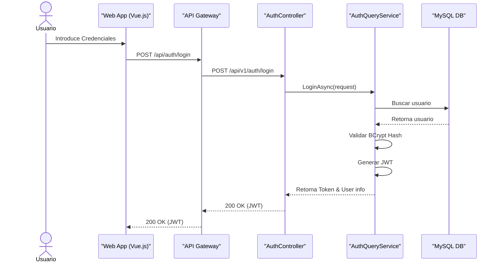

### B. Registro de Movimiento de Stock
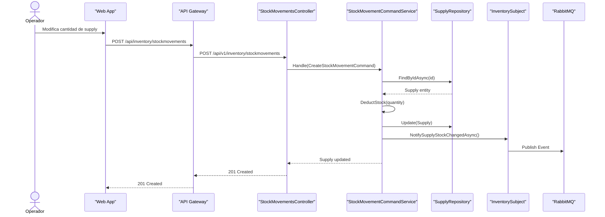

---

## 6. Vista Física

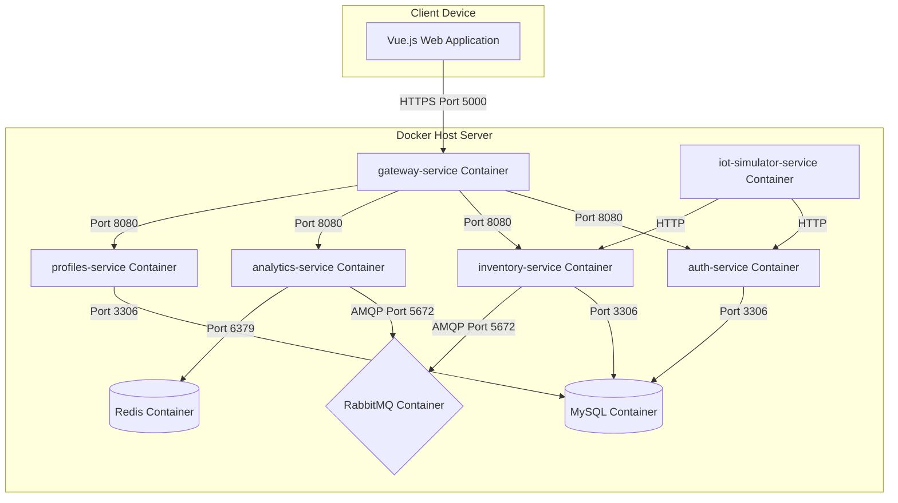

---

## 7. Vista Modular

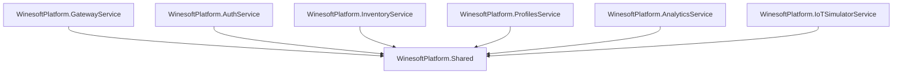

---

## 8. Vista de Despliegue

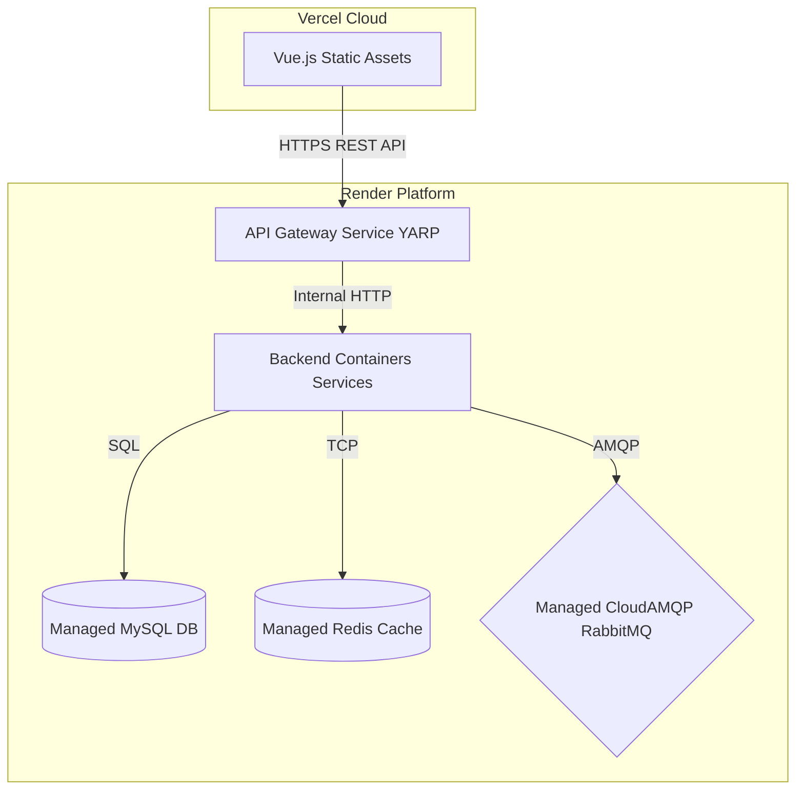

---

## 9. Modelo de Datos (Diagrama ER)

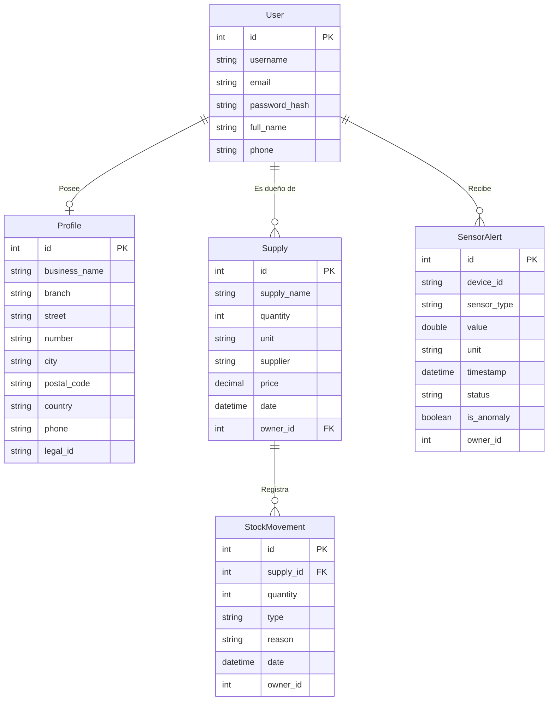
