# Diagramas de Arquitectura Vintara - C4, UML & Vistas

Este documento contiene los diagramas arquitectónicos del backend de **Vintara (WineSoft)** modelados en **PlantUML**. 
Puede visualizarlos directamente como imágenes (cargadas localmente desde el directorio `docs/diagrams/`) o copiar/editar el código fuente en formato PlantUML.

---

## 1. C4 Context Diagram

```plantuml
@startuml
!include https://raw.githubusercontent.com/plantuml-stdlib/C4-PlantUML/master/C4_Context.puml

LAYOUT_WITH_LEGEND()

title C4 Context Diagram - Plataforma WineSoft

Person(owner, "Dueño de Negocio (Owner)", "Administra la bodega, inventario y visualiza reportes analíticos.")
Person(operator, "Operador (Operator)", "Registra movimientos de stock e interactúa con alertas en tiempo real.")

System(winesoft, "Plataforma WineSoft", "Sistema centralizado para gestión de inventarios, alertas IoT, analítica de datos y perfiles.")
System(iot_simulator, "Servidor de Simulación IoT", "Genera lecturas simuladas de telemetría (temperatura, humedad, presión, nivel) y las envía al sistema.")

Rel(owner, winesoft, "Visualiza reportes, gestiona inventario y perfiles", "HTTPS")
Rel(operator, winesoft, "Registra stock, gestiona alertas", "HTTPS")
Rel(iot_simulator, winesoft, "Envía telemetría de sensores en tiempo real", "HTTP / REST")

@enduml
```

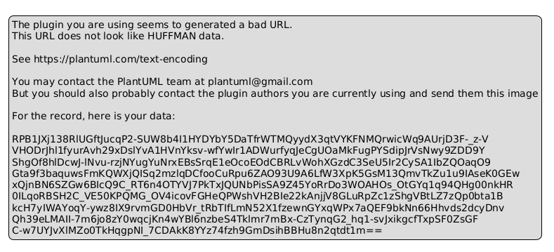

---

## 2. C4 Container Diagram

```plantuml
@startuml
!include https://raw.githubusercontent.com/plantuml-stdlib/C4-PlantUML/master/C4_Container.puml

LAYOUT_WITH_LEGEND()

title C4 Container Diagram - Plataforma WineSoft

Person(owner, "Dueño de Negocio (Owner)")
Person(operator, "Operador (Operator)")

System_Boundary(winesoft_system, "Límites del Sistema WineSoft") {
    Container(web_app, "Aplicación Web (SPA)", "Vue.js 3, Vite, Pinia", "Interfaz de usuario para interactuar con todas las funcionalidades del sistema.")
    Container(gateway, "API Gateway", "ASP.NET Core, YARP", "Punto de entrada único. Enruta peticiones HTTP hacia los microservicios correspondientes.")
    
    Container(auth_service, "AuthService", "ASP.NET Core, C#", "Maneja autenticación, registro de usuarios, contraseñas y generación de JWT.")
    Container(inventory_service, "InventoryService", "ASP.NET Core, C#", "Gestiona suministros, transacciones de stock, alertas de sensores y lógica de AlertEngine.")
    Container(profiles_service, "ProfilesService", "ASP.NET Core, C#", "Gestiona los perfiles fiscales y empresariales vinculados a los usuarios.")
    Container(analytics_service, "AnalyticsService", "ASP.NET Core, C#", "Gestiona reportes analíticos de rotación, niveles de stock y alertas.")
    
    ContainerDb(mysql_db, "Base de Datos Relacional (MySQL)", "MySQL 8.0", "Almacena datos persistentes en esquemas separados para cada microservicio.")
    ContainerDb(redis_cache, "Caché Distribuido (Redis)", "Redis", "Almacena en caché consultas analíticas frecuentes de inventario.")
    Container(rabbitmq, "Message Broker (RabbitMQ)", "RabbitMQ", "Canal de mensajería asíncrona mediante eventos usando MassTransit.")
}

System(iot_simulator, "Servicio Simulador IoT", "ASP.NET Core Worker", "Genera simulaciones continuas y envía telemetría directamente a los servicios internos.")

Rel(owner, web_app, "Usa", "HTTPS")
Rel(operator, web_app, "Usa", "HTTPS")

Rel(web_app, gateway, "Peticiones de API", "HTTPS / JSON")

Rel(gateway, auth_service, "Enruta /api/auth", "HTTP / JSON")
Rel(gateway, inventory_service, "Enruta /api/inventory", "HTTP / JSON")
Rel(gateway, profiles_service, "Enruta /api/profiles", "HTTP / JSON")
Rel(gateway, analytics_service, "Enruta /api/analytics", "HTTP / JSON")

Rel(auth_service, mysql_db, "Lee/Escribe usuarios", "EF Core / TCP")
Rel(profiles_service, mysql_db, "Lee/Escribe perfiles", "EF Core / TCP")
Rel(inventory_service, mysql_db, "Lee/Escribe suministros y alertas", "EF Core / TCP")

Rel(iot_simulator, auth_service, "Solicita token de servicio", "HTTP / JSON")
Rel(iot_simulator, inventory_service, "Registra telemetría", "HTTP / JSON")

Rel(inventory_service, rabbitmq, "Publica eventos (SupplyStockChanged)", "AMQP / MassTransit")
Rel(rabbitmq, analytics_service, "Consume eventos (SupplyStockChanged)", "AMQP / MassTransit")

Rel(analytics_service, redis_cache, "Consulta/Guarda reportes", "StackExchange.Redis")
Rel(analytics_service, inventory_service, "Consulta datos históricos de inventario", "HTTP / JSON")

@enduml
```

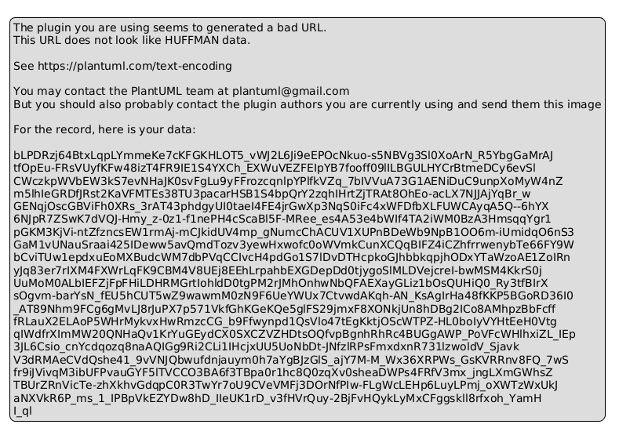

---

## 3. C4 Component Diagrams

### A. GatewayService
```plantuml
@startuml
!include https://raw.githubusercontent.com/plantuml-stdlib/C4-PlantUML/master/C4_Component.puml

title C4 Component Diagram - GatewayService

Container(web_app, "Aplicación Web (SPA)", "Vue.js", "Envía solicitudes HTTPS")

Container_Boundary(gateway_boundary, "GatewayService") {
    Component(program, "Program.cs", "ASP.NET Core", "Punto de entrada, arranca el pipeline de ASP.NET y configura los servicios.")
    Component(yarp, "YARP Middleware", "Microsoft.AspNetCore.ReverseProxy", "Carga la configuración de rutas y enruta las peticiones de forma dinámica.")
    Component(cors_policy, "CORS Middleware", "ASP.NET Core CORS", "Valida los orígenes permitidos (localhost, Render, Vercel).")
    Component(appsettings, "appsettings.json", "JSON Config", "Contiene las definiciones de rutas, clústeres y destinos de YARP.")
}

Container(auth_service, "AuthService", "REST API")
Container(inventory_service, "InventoryService", "REST API")
Container(profiles_service, "ProfilesService", "REST API")
Container(analytics_service, "AnalyticsService", "REST API")

Rel(web_app, cors_policy, "Llamadas HTTP", "HTTPS")
Rel(cors_policy, yarp, "Petición autorizada")
Rel(program, yarp, "Configura enrutamiento")
Rel(program, appsettings, "Lee configuraciones")

Rel(yarp, auth_service, "Enruta /api/auth", "HTTP")
Rel(yarp, inventory_service, "Enruta /api/inventory", "HTTP")
Rel(yarp, profiles_service, "Enruta /api/profiles", "HTTP")
Rel(yarp, analytics_service, "Enruta /api/analytics", "HTTP")

@enduml
```

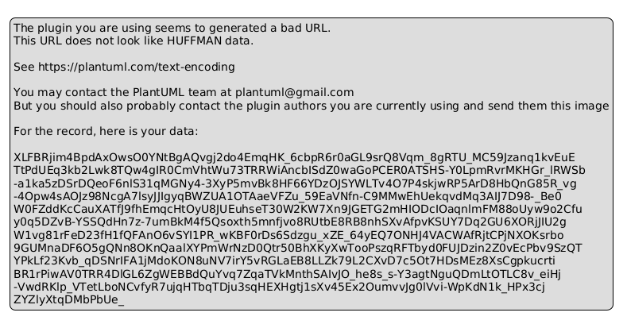

### B. AuthService
```plantuml
@startuml
!include https://raw.githubusercontent.com/plantuml-stdlib/C4-PlantUML/master/C4_Component.puml

title C4 Component Diagram - AuthService

Container(gateway, "API Gateway", "YARP")
ContainerDb(mysql_db, "Base de Datos", "MySQL")

Container_Boundary(auth_boundary, "AuthService") {
    Component(auth_controller, "AuthController", "REST Controller", "Expone endpoints para login, registro de usuarios, cambio de contraseña y generación de tokens de servicio.")
    Component(auth_query_svc, "AuthQueryService", "Application Query Service", "Procesa consultas de autenticación y encapsula la generación de tokens JWT.")
    Component(auth_cmd_svc, "AuthCommandService", "Application Command Service", "Procesa comandos de registro de usuarios y actualización de datos con encriptación BCrypt.")
    Component(user_repo, "UserRepository", "Infrastructure Repository", "Gestiona la persistencia de la entidad User.")
    Component(auth_db_context, "AuthDbContext", "EF Core DbContext", "Configuración de persistencia para las tablas de autenticación.")
    Component(user_entity, "User", "Domain Model", "Entidad de dominio que representa a los usuarios del sistema.")
}

Rel(gateway, auth_controller, "Solicitudes /api/auth", "HTTP")
Rel(auth_controller, auth_query_svc, "Llama")
Rel(auth_controller, auth_cmd_svc, "Llama")
Rel(auth_query_svc, user_repo, "Busca usuario")
Rel(auth_cmd_svc, user_repo, "Guarda usuario")
Rel(user_repo, auth_db_context, "Usa")
Rel(auth_db_context, user_entity, "Mapea")
Rel(auth_db_context, mysql_db, "Lee/Escribe en winesoft_auth", "TCP/IP")

@enduml
```

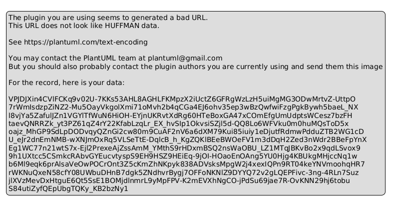

### C. InventoryService
```plantuml
@startuml
!include https://raw.githubusercontent.com/plantuml-stdlib/C4-PlantUML/master/C4_Component.puml

title C4 Component Diagram - InventoryService

Container(gateway, "API Gateway", "YARP")
Container(rabbitmq, "Message Broker", "RabbitMQ")
ContainerDb(mysql_db, "Base de Datos", "MySQL")

Container_Boundary(inventory_boundary, "InventoryService") {
    Component(supplies_ctrl, "SuppliesController", "REST Controller", "Expone CRUD de suministros.")
    Component(movements_ctrl, "StockMovementsController", "REST Controller", "Expone registro e historial de movimientos de stock.")
    Component(alerts_ctrl, "SensorAlertsController", "REST Controller", "Recibe telemetría IoT y expone alertas.")
    
    Component(supply_cmd_svc, "SupplyCommandService", "Command Service", "Maneja creación, actualización y eliminación de suministros.")
    Component(movement_cmd_svc, "StockMovementCommandService", "Command Service", "Registra movimientos y actualiza el stock disponible.")
    Component(alert_cmd_svc, "SensorAlertCommandService", "Command Service", "Procesa la ingesta de telemetría.")
    
    Component(supply_query_svc, "SupplyQueryService", "Query Service", "Consultas de suministros validadas por OwnerId.")
    Component(movement_query_svc, "StockMovementQueryService", "Query Service", "Historial de transacciones de stock.")
    Component(alert_query_svc, "SensorAlertQueryService", "Query Service", "Consultas paginadas de alertas IoT.")
    
    Component(alert_engine, "AlertEngine", "Domain Service", "Clasifica lecturas de sensores (NORMAL, WARNING, CRITICAL) y detecta anomalías.")
    Component(inv_subject, "InventorySubject", "Domain Event Publisher", "Notifica a observadores locales y publica eventos a RabbitMQ.")
    
    Component(supply_repo, "SupplyRepository", "Infrastructure Repository", "Persistencia de Supply.")
    Component(movement_repo, "StockMovementRepository", "Infrastructure Repository", "Persistencia de StockMovement.")
    Component(alert_repo, "SensorAlertRepository", "Infrastructure Repository", "Persistencia de SensorAlert.")
    
    Component(inv_db_context, "InventoryDbContext", "EF Core DbContext", "Acceso a tablas de inventario en MySQL.")
}

Rel(gateway, supplies_ctrl, "HTTP /api/inventory/supplies")
Rel(gateway, movements_ctrl, "HTTP /api/inventory/stockmovements")
Rel(gateway, alerts_ctrl, "HTTP /api/inventory/sensoralerts")

Rel(supplies_ctrl, supply_cmd_svc, "Usa")
Rel(supplies_ctrl, supply_query_svc, "Usa")
Rel(movements_ctrl, movement_cmd_svc, "Usa")
Rel(movements_ctrl, movement_query_svc, "Usa")
Rel(alerts_ctrl, alert_cmd_svc, "Usa")
Rel(alerts_ctrl, alert_query_svc, "Usa")

Rel(supply_cmd_svc, supply_repo, "Usa")
Rel(supply_cmd_svc, inv_subject, "Notifica cambios de stock")
Rel(movement_cmd_svc, movement_repo, "Usa")
Rel(movement_cmd_svc, supply_repo, "Actualiza stock")
Rel(movement_cmd_svc, inv_subject, "Notifica cambios")
Rel(alert_cmd_svc, inv_subject, "Notifica lectura de sensor")

Rel(supply_query_svc, supply_repo, "Usa")
Rel(movement_query_svc, movement_repo, "Usa")
Rel(alert_query_svc, alert_repo, "Usa")

Rel(inv_subject, alert_engine, "Llama OnSensorReadingReceivedAsync / OnSupplyStockChangedAsync")
Rel(inv_subject, rabbitmq, "Publica SupplyStockChanged", "MassTransit")

Rel(alert_engine, alert_repo, "Guarda alerta generada")

Rel(supply_repo, inv_db_context, "Usa")
Rel(movement_repo, inv_db_context, "Usa")
Rel(alert_repo, inv_db_context, "Usa")

Rel(inv_db_context, mysql_db, "Persiste en winesoft_inventory", "TCP/IP")

@enduml
```

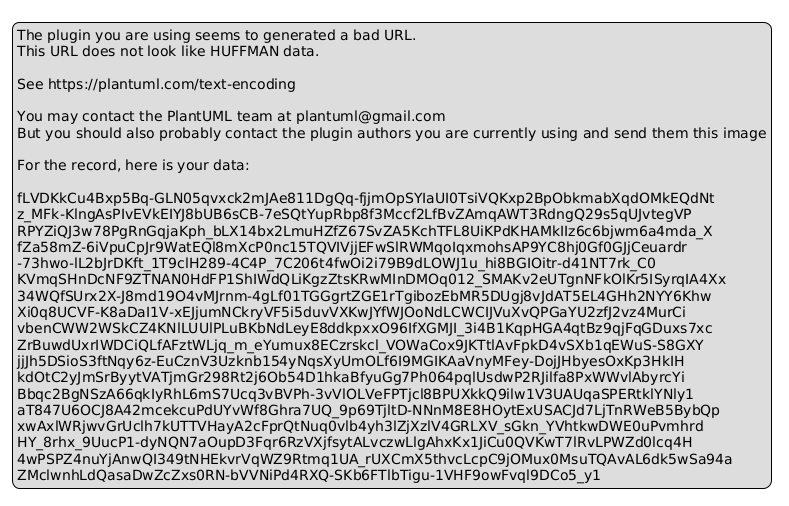

### D. ProfilesService
```plantuml
@startuml
!include https://raw.githubusercontent.com/plantuml-stdlib/C4-PlantUML/master/C4_Component.puml

title C4 Component Diagram - ProfilesService

Container(gateway, "API Gateway", "YARP")
ContainerDb(mysql_db, "Base de Datos", "MySQL")

Container_Boundary(profiles_boundary, "ProfilesService") {
    Component(profiles_ctrl, "ProfilesController", "REST Controller", "Endpoints para gestionar perfiles fiscales de negocio.")
    Component(profile_cmd_svc, "ProfileCommandService", "Command Service", "Procesa creación y modificación de perfiles de negocio.")
    Component(profile_query_svc, "ProfileQueryService", "Query Service", "Recupera datos de perfiles por ID u Owner.")
    Component(profile_facade, "ProfilesContextFacade", "Anti-Corruption Layer (ACL)", "Facade pública para exponer los perfiles a otros contextos si es requerido.")
    Component(profile_repo, "ProfileRepository", "Infrastructure Repository", "Persistencia de perfiles de negocio.")
    Component(profiles_db_context, "ProfilesDbContext", "EF Core DbContext", "Configuración de base de datos de perfiles.")
}

Rel(gateway, profiles_ctrl, "HTTP /api/profiles")
Rel(profiles_ctrl, profile_cmd_svc, "Usa")
Rel(profiles_ctrl, profile_query_svc, "Usa")
Rel(profile_facade, profile_query_svc, "Usa")
Rel(profile_cmd_svc, profile_repo, "Usa")
Rel(profile_query_svc, profile_repo, "Usa")
Rel(profile_repo, profiles_db_context, "Usa")
Rel(profiles_db_context, mysql_db, "Persiste en winesoft_profiles", "TCP/IP")

@enduml
```

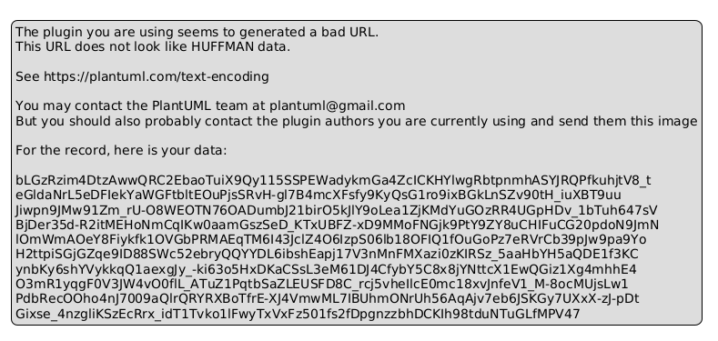

### E. AnalyticsService
```plantuml
@startuml
!include https://raw.githubusercontent.com/plantuml-stdlib/C4-PlantUML/master/C4_Component.puml

title C4 Component Diagram - AnalyticsService

Container(gateway, "API Gateway", "YARP")
Container(rabbitmq, "Message Broker", "RabbitMQ")
ContainerDb(redis_cache, "Caché", "Redis")
Container(inventory_service, "InventoryService", "REST API")

Container_Boundary(analytics_boundary, "AnalyticsService") {
    Component(analytics_ctrl, "AnalyticsController", "REST Controller", "Expone endpoints para reportes, alertas de bajo stock y rotación.")
    Component(analytics_cmd_svc, "AnalyticsCommandService", "Command Service", "Genera solicitudes de análisis.")
    Component(analytics_query_svc, "AnalyticsQueryService", "Query Service", "Calcula métricas analíticas e integra caché Redis.")
    Component(stock_consumer, "SupplyStockChangedConsumer", "MassTransit Consumer", "Escucha variaciones de stock desde RabbitMQ para invalidar reportes.")
    Component(pdf_builder, "QuestPdfAnalyticsReportBuilder", "Infrastructure Service", "Renderiza reportes en formato PDF.")
    Component(cache_svc, "AnalyticsCacheService", "Infrastructure Service", "Abstracción sobre IDistributedCache para interactuar con Redis.")
    Component(srv_clients, "ServiceClients", "HTTP Client Service", "Consulta datos directamente al microservicio de inventario.")
    Component(analytics_repo, "AnalyticsRepository", "Infrastructure Repository", "Maneja datos analíticos locales si existen.")
}

Rel(gateway, analytics_ctrl, "HTTP /api/analytics")
Rel(analytics_ctrl, analytics_query_svc, "Usa")
Rel(analytics_ctrl, analytics_cmd_svc, "Usa")

Rel(analytics_query_svc, cache_svc, "Verifica caché")
Rel(analytics_query_svc, srv_clients, "Consulta suministros e historial")
Rel(analytics_query_svc, pdf_builder, "Llama para generar PDF")

Rel(stock_consumer, cache_svc, "Invalida caché al ocurrir cambios de stock")
Rel(rabbitmq, stock_consumer, "Despacha evento", "AMQP")

Rel(srv_clients, inventory_service, "Llamadas HTTP internas", "HTTP / JSON")
Rel(cache_svc, redis_cache, "Almacena/Recupera JSON", "TCP")

@enduml
```

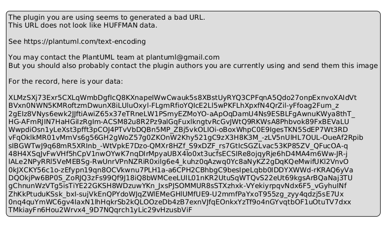

### F. IoTSimulatorService
```plantuml
@startuml
!include https://raw.githubusercontent.com/plantuml-stdlib/C4-PlantUML/master/C4_Component.puml

title C4 Component Diagram - IoTSimulatorService

Container(auth_service, "AuthService", "REST API")
Container(inventory_service, "InventoryService", "REST API")

Container_Boundary(iot_boundary, "IoTSimulatorService") {
    Component(sim_engine, "SimulationEngine", "IHostedService", "Hilo de fondo que inicializa el bucle de simulación e interactúa con APIs externas.")
    Component(sim_factory, "DeviceSimulatorFactory", "Factory Pattern", "Crea instancias de simuladores según el tipo de lectura.")
    Component(base_sim, "BaseDeviceSimulator", "Base Class", "Implementa comportamiento común para las caminatas aleatorias.")
    Component(concrete_sims, "ConcreteSensorSimulators", "Simulators", "Implementa algoritmos específicos para temperatura, humedad, presión y nivel.")
}

Rel(sim_engine, auth_service, "Petición de token de servicio", "HTTP POST")
Rel(sim_engine, sim_factory, "Solicita simulador")
Rel(sim_factory, concrete_sims, "Instancia")
Rel(concrete_sims, base_sim, "Hereda de")
Rel(sim_engine, concrete_sims, "Ejecuta paso de simulación")
Rel(sim_engine, inventory_service, "Envía telemetría generada", "HTTP POST")

@enduml
```

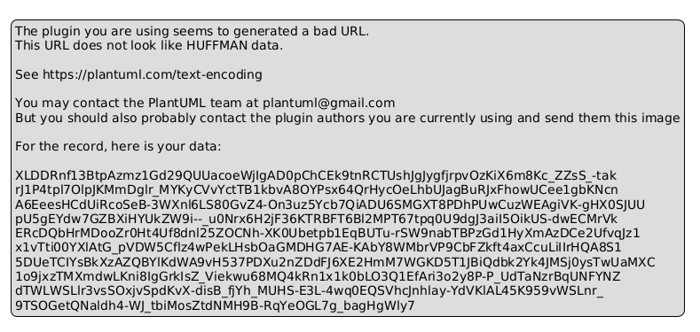

---

## 4. C4 Code Diagrams (Diagramas de Clase UML)

### A. AuthService
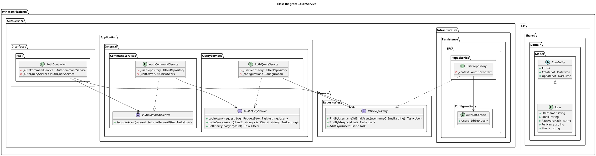
```plantuml
@startuml
title Class Diagram - AuthService

package WinesoftPlatform.API.Shared.Domain.Model {
    abstract class BaseEntity {
        + Id : int
        + CreatedAt : DateTime
        + UpdatedAt : DateTime
    }

    class User {
        + Username : string
        + Email : string
        + PasswordHash : string
        + FullName : string
        + Phone : string
    }
    
    BaseEntity <|-- User
}

package WinesoftPlatform.AuthService.Domain.Repositories {
    interface IUserRepository {
        + FindByUsernameOrEmailAsync(usernameOrEmail: string) : Task<User>
        + FindByIdAsync(id: int) : Task<User>
        + AddAsync(user: User) : Task
    }
}

package WinesoftPlatform.AuthService.Infrastructure.Persistence.EFC.Configuration {
    class AuthDbContext {
        + Users : DbSet<User>
    }
}

package WinesoftPlatform.AuthService.Infrastructure.Persistence.EFC.Repositories {
    class UserRepository {
        - _context : AuthDbContext
    }
    UserRepository ..|> IUserRepository
    UserRepository --> AuthDbContext
}

package WinesoftPlatform.AuthService.Application.Internal.QueryServices {
    interface IAuthQueryService {
        + LoginAsync(request: LoginRequestDto) : Task<(string, User)>
        + LoginServiceAsync(clientId: string, clientSecret: string) : Task<string>
        + GetUserByIdAsync(id: int) : Task<User>
    }
    
    class AuthQueryService {
        - _userRepository : IUserRepository
        - _configuration : IConfiguration
    }
    AuthQueryService ..|> IAuthQueryService
    AuthQueryService --> IUserRepository
}

package WinesoftPlatform.AuthService.Application.Internal.CommandServices {
    interface IAuthCommandService {
        + RegisterAsync(request: RegisterRequestDto) : Task<User>
    }
    
    class AuthCommandService {
        - _userRepository : IUserRepository
        - _unitOfWork : IUnitOfWork
    }
    AuthCommandService ..|> IAuthCommandService
    AuthCommandService --> IUserRepository
}

package WinesoftPlatform.AuthService.Interfaces.REST {
    class AuthController {
        - _authCommandService : IAuthCommandService
        - _authQueryService : IAuthQueryService
    }
    AuthController --> IAuthCommandService
    AuthController --> IAuthQueryService
}

@enduml
```

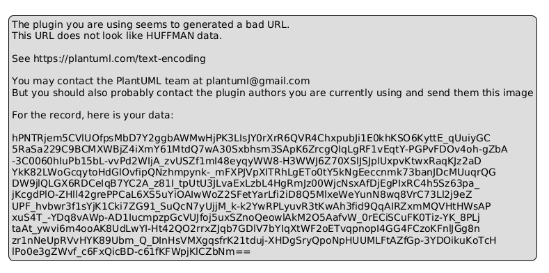

### B. InventoryService
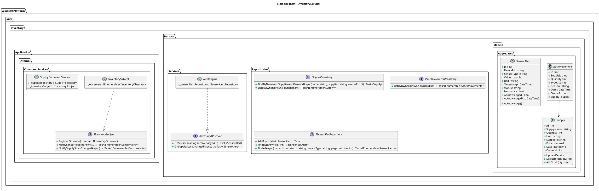
```plantuml
@startuml
title Class Diagram - InventoryService

package WinesoftPlatform.API.Inventory.Domain.Model.Aggregates {
    class Supply {
        + Id : int
        + SupplyName : string
        + Quantity : int
        + Unit : string
        + Supplier : string
        + Price : decimal
        + Date : DateTime
        + OwnerId : int
        + UpdateDetails(...)
        + DeductStock(qty: int)
        + AddStock(qty: int)
    }

    class StockMovement {
        + Id : int
        + SupplyId : int
        + Quantity : int
        + Type : string
        + Reason : string
        + Date : DateTime
        + OwnerId : int
        + Supply : Supply
    }

    class SensorAlert {
        + Id : int
        + DeviceId : string
        + SensorType : string
        + Value : double
        + Unit : string
        + Timestamp : DateTime
        + Status : string
        + IsAnomaly : bool
        + Acknowledged : bool
        + AcknowledgedAt : DateTime?
        + Acknowledge()
    }
    
    StockMovement --> Supply
}

package WinesoftPlatform.API.Inventory.Domain.Repositories {
    interface ISupplyRepository {
        + FindByNameAndSupplierAndOwnerIdAsync(name: string, supplier: string, ownerId: int) : Task<Supply>
        + ListByOwnerIdAsync(ownerId: int) : Task<IEnumerable<Supply>>
    }
    interface IStockMovementRepository {
        + ListByOwnerIdAsync(ownerId: int) : Task<IEnumerable<StockMovement>>
    }
    interface ISensorAlertRepository {
        + AddAsync(alert: SensorAlert) : Task
        + FindByIdAsync(id: int) : Task<SensorAlert>
        + FindAllAsync(ownerId: int, status: string, sensorType: string, page: int, size: int) : Task<IEnumerable<SensorAlert>>
    }
}

package WinesoftPlatform.API.Inventory.Domain.Services {
    interface IInventoryObserver {
        + OnSensorReadingReceivedAsync(...) : Task<SensorAlert>
        + OnSupplyStockChangedAsync(...) : Task<SensorAlert>
    }
    
    class AlertEngine {
        - _sensorAlertRepository : ISensorAlertRepository
    }
    AlertEngine ..|> IInventoryObserver
}

package WinesoftPlatform.API.Inventory.Application.Internal.CommandServices {
    interface IInventorySubject {
        + RegisterObserver(observer: IInventoryObserver)
        + NotifySensorReadingAsync(...) : Task<IEnumerable<SensorAlert>>
        + NotifySupplyStockChangedAsync(...) : Task<IEnumerable<SensorAlert>>
    }
    
    class InventorySubject {
        - _observers : IEnumerable<IInventoryObserver>
    }
    InventorySubject ..|> IInventorySubject
    
    class SupplyCommandService {
        - _supplyRepository : ISupplyRepository
        - _inventorySubject : IInventorySubject
    }
}

@enduml
```

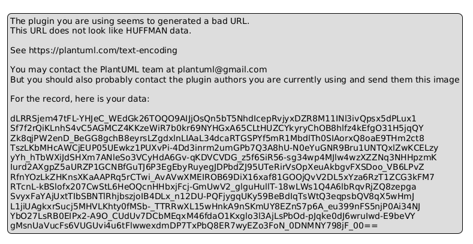

### C. ProfilesService
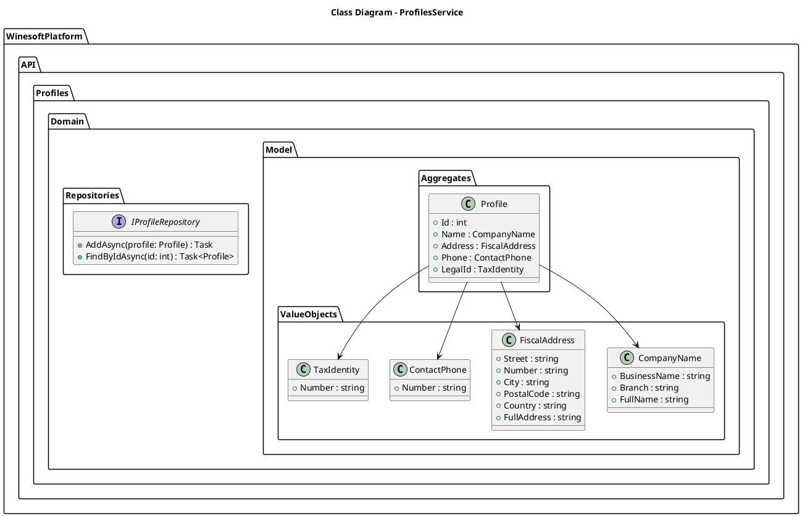
```plantuml
@startuml
title Class Diagram - ProfilesService

package WinesoftPlatform.API.Profiles.Domain.Model.ValueObjects {
    class CompanyName {
        + BusinessName : string
        + Branch : string
        + FullName : string
    }
    class FiscalAddress {
        + Street : string
        + Number : string
        + City : string
        + PostalCode : string
        + Country : string
        + FullAddress : string
    }
    class ContactPhone {
        + Number : string
    }
    class TaxIdentity {
        + Number : string
    }
}

package WinesoftPlatform.API.Profiles.Domain.Model.Aggregates {
    class Profile {
        + Id : int
        + Name : CompanyName
        + Address : FiscalAddress
        + Phone : ContactPhone
        + LegalId : TaxIdentity
    }
    Profile --> CompanyName
    Profile --> FiscalAddress
    Profile --> ContactPhone
    Profile --> TaxIdentity
}

package WinesoftPlatform.API.Profiles.Domain.Repositories {
    interface IProfileRepository {
        + AddAsync(profile: Profile) : Task
        + FindByIdAsync(id: int) : Task<Profile>
    }
}

@enduml
```

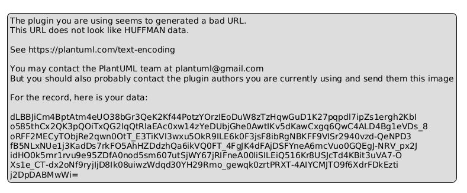

### D. AnalyticsService
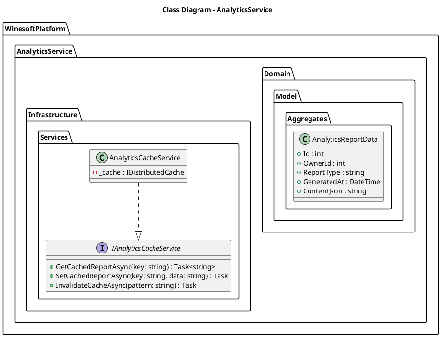
```plantuml
@startuml
title Class Diagram - AnalyticsService

package WinesoftPlatform.AnalyticsService.Domain.Model.Aggregates {
    class AnalyticsReportData {
        + Id : int
        + OwnerId : int
        + ReportType : string
        + GeneratedAt : DateTime
        + ContentJson : string
    }
}

package WinesoftPlatform.AnalyticsService.Infrastructure.Services {
    interface IAnalyticsCacheService {
        + GetCachedReportAsync(key: string) : Task<string>
        + SetCachedReportAsync(key: string, data: string) : Task
        + InvalidateCacheAsync(pattern: string) : Task
    }
    class AnalyticsCacheService {
        - _cache : IDistributedCache
    }
    AnalyticsCacheService ..|> IAnalyticsCacheService
}

@enduml
```

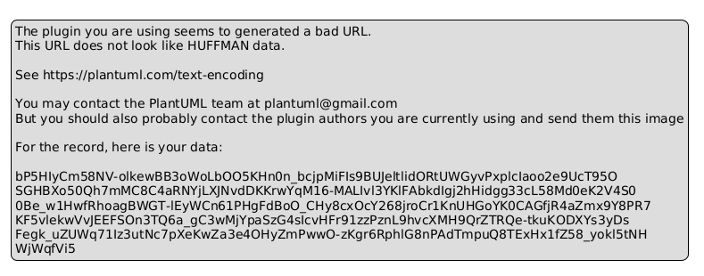

### E. IoTSimulatorService
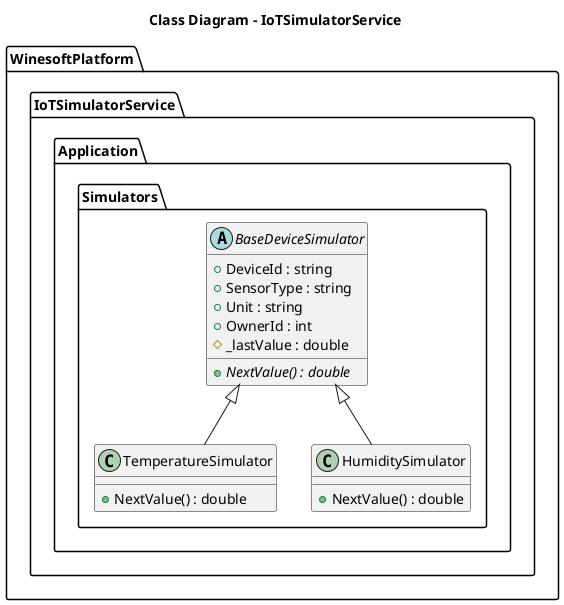
```plantuml
@startuml
title Class Diagram - IoTSimulatorService

package WinesoftPlatform.IoTSimulatorService.Application.Simulators {
    abstract class BaseDeviceSimulator {
        + DeviceId : string
        + SensorType : string
        + Unit : string
        + OwnerId : int
        # _lastValue : double
        + {abstract} NextValue() : double
    }

    class TemperatureSimulator {
        + NextValue() : double
    }
    class HumiditySimulator {
        + NextValue() : double
    }

    BaseDeviceSimulator <|-- TemperatureSimulator
    BaseDeviceSimulator <|-- HumiditySimulator
}

@enduml
```

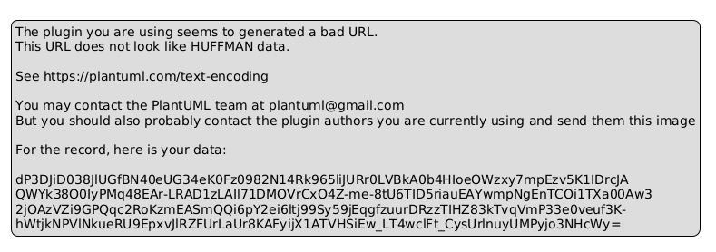

---

## 5. Vista Lógica

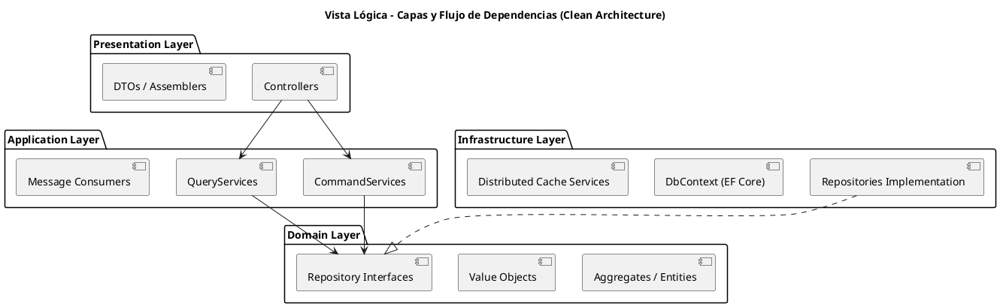
```plantuml
@startuml
title Vista Lógica - Capas y Flujo de Dependencias (Clean Architecture)

package "Presentation Layer" {
    [Controllers]
    [DTOs / Assemblers]
}

package "Application Layer" {
    [CommandServices]
    [QueryServices]
    [Message Consumers]
}

package "Domain Layer" {
    [Aggregates / Entities]
    [Value Objects]
    [Repository Interfaces]
}

package "Infrastructure Layer" {
    [Repositories Implementation]
    [DbContext (EF Core)]
    [Distributed Cache Services]
}

[Controllers] --> [CommandServices]
[Controllers] --> [QueryServices]
[CommandServices] --> [Repository Interfaces]
[QueryServices] --> [Repository Interfaces]
[Repositories Implementation] ..|> [Repository Interfaces]

@enduml
```

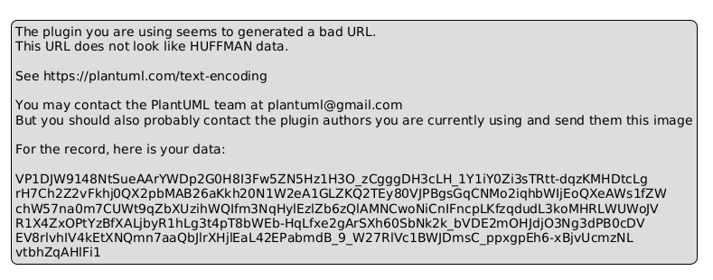

---

## 6. Vista de Comportamiento (Diagramas de Secuencia)

### A. Inicio de Sesión
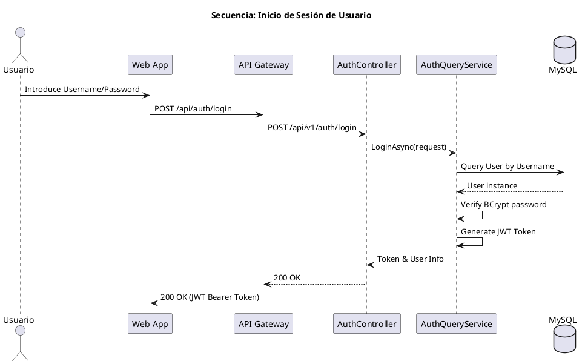
```plantuml
@startuml
title Secuencia: Inicio de Sesión de Usuario

actor Usuario
participant "Web App" as SPA
participant "API Gateway" as GW
participant "AuthController" as Ctrl
participant "AuthQueryService" as Svc
database "MySQL" as DB

Usuario -> SPA: Introduce Username/Password
SPA -> GW: POST /api/auth/login
GW -> Ctrl: POST /api/v1/auth/login
Ctrl -> Svc: LoginAsync(request)
Svc -> DB: Query User by Username
DB --> Svc: User instance
Svc -> Svc: Verify BCrypt password
Svc -> Svc: Generate JWT Token
Svc --> Ctrl: Token & User Info
Ctrl --> GW: 200 OK
GW --> SPA: 200 OK (JWT Bearer Token)
@enduml
```

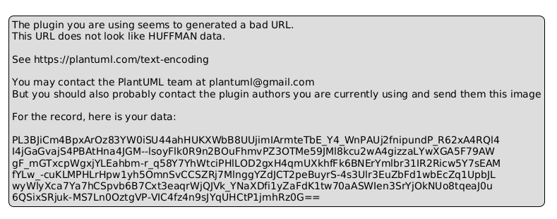

### B. Registro de Movimiento de Stock
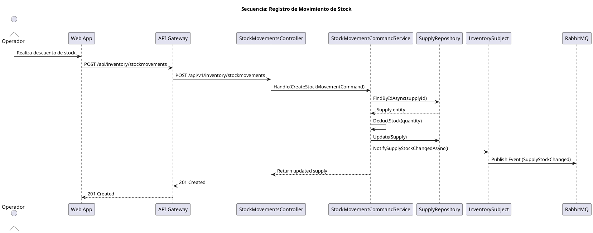
```plantuml
@startuml
title Secuencia: Registro de Movimiento de Stock

actor Operador
participant "Web App" as SPA
participant "API Gateway" as GW
participant "StockMovementsController" as Ctrl
participant "StockMovementCommandService" as Svc
participant "SupplyRepository" as SRepo
participant "InventorySubject" as Subj
participant "RabbitMQ" as Broker

Operador -> SPA: Realiza descuento de stock
SPA -> GW: POST /api/inventory/stockmovements
GW -> Ctrl: POST /api/v1/inventory/stockmovements
Ctrl -> Svc: Handle(CreateStockMovementCommand)
Svc -> SRepo: FindByIdAsync(supplyId)
SRepo --> Svc: Supply entity
Svc -> Svc: DeductStock(quantity)
Svc -> SRepo: Update(Supply)
Svc -> Subj: NotifySupplyStockChangedAsync()
Subj -> Broker: Publish Event (SupplyStockChanged)
Svc --> Ctrl: Return updated supply
Ctrl --> GW: 201 Created
GW --> SPA: 201 Created
@enduml
```

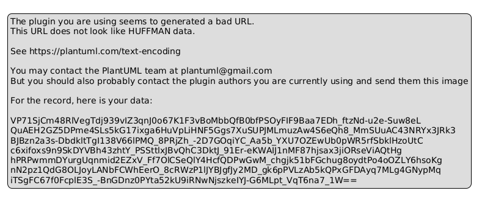

### C. Ingesta de Telemetría IoT
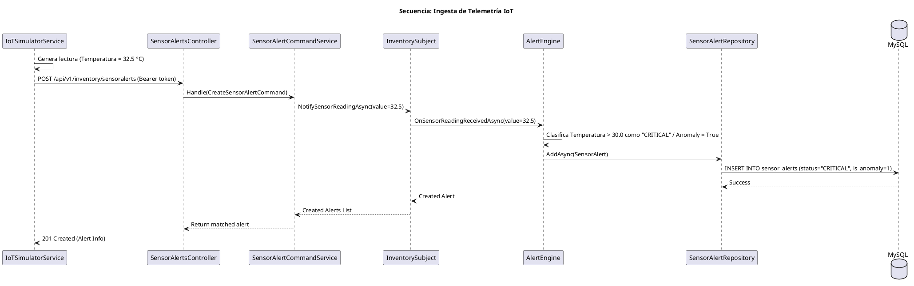
```plantuml
@startuml
title Secuencia: Ingesta de Telemetría IoT

participant "IoTSimulatorService" as Sim
participant "SensorAlertsController" as Ctrl
participant "SensorAlertCommandService" as Svc
participant "InventorySubject" as Subj
participant "AlertEngine" as Engine
participant "SensorAlertRepository" as Repo
database "MySQL" as DB

Sim -> Sim: Genera lectura (Temperatura = 32.5 °C)
Sim -> Ctrl: POST /api/v1/inventory/sensoralerts (Bearer token)
Ctrl -> Svc: Handle(CreateSensorAlertCommand)
Svc -> Subj: NotifySensorReadingAsync(value=32.5)
Subj -> Engine: OnSensorReadingReceivedAsync(value=32.5)
Engine -> Engine: Clasifica Temperatura > 30.0 como "CRITICAL" / Anomaly = True
Engine -> Repo: AddAsync(SensorAlert)
Repo -> DB: INSERT INTO sensor_alerts (status="CRITICAL", is_anomaly=1)
DB --> Repo: Success
Engine --> Subj: Created Alert
Subj --> Svc: Created Alerts List
Svc --> Ctrl: Return matched alert
Ctrl --> Sim: 201 Created (Alert Info)
@enduml
```

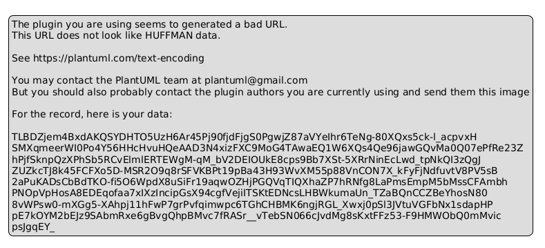

---

## 7. Vista Física

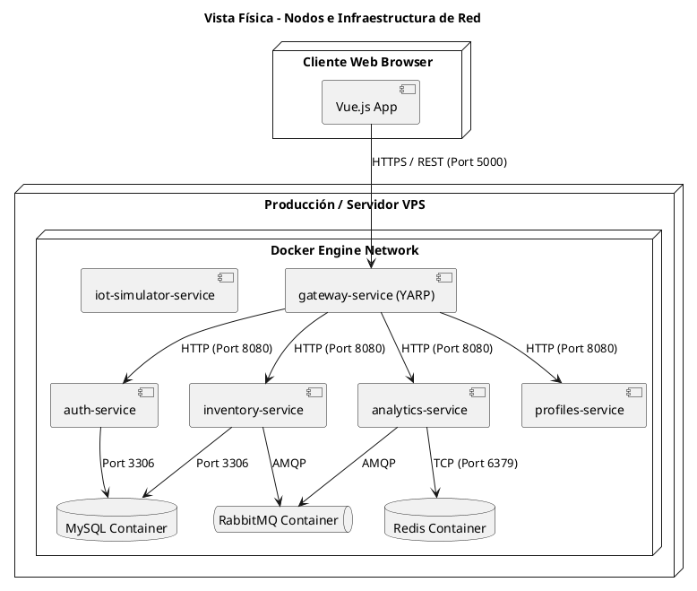
```plantuml
@startuml
title Vista Física - Nodos e Infraestructura de Red

node "Cliente Web Browser" {
    component "Vue.js App" as Frontend
}

node "Producción / Servidor VPS" {
    node "Docker Engine Network" {
        component "gateway-service (YARP)" as GWContainer
        component "auth-service" as AuthContainer
        component "inventory-service" as InvContainer
        component "analytics-service" as AnalContainer
        component "profiles-service" as ProfContainer
        component "iot-simulator-service" as IotContainer
        database "MySQL Container" as MySQL
        database "Redis Container" as Redis
        queue "RabbitMQ Container" as RabbitMQ
    }
}

Frontend --> GWContainer: HTTPS / REST (Port 5000)
GWContainer --> AuthContainer: HTTP (Port 8080)
GWContainer --> InvContainer: HTTP (Port 8080)
GWContainer --> AnalContainer: HTTP (Port 8080)
GWContainer --> ProfContainer: HTTP (Port 8080)

InvContainer --> RabbitMQ: AMQP
AnalContainer --> RabbitMQ: AMQP
AnalContainer --> Redis: TCP (Port 6379)
AuthContainer --> MySQL: Port 3306
InvContainer --> MySQL: Port 3306

@enduml
```

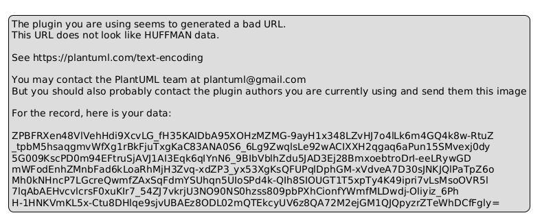

---

## 8. Vista Modular

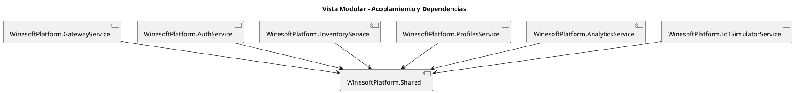
```plantuml
@startuml
title Vista Modular - Acoplamiento y Dependencias

[WinesoftPlatform.GatewayService] --> [WinesoftPlatform.Shared]
[WinesoftPlatform.AuthService] --> [WinesoftPlatform.Shared]
[WinesoftPlatform.InventoryService] --> [WinesoftPlatform.Shared]
[WinesoftPlatform.ProfilesService] --> [WinesoftPlatform.Shared]
[WinesoftPlatform.AnalyticsService] --> [WinesoftPlatform.Shared]
[WinesoftPlatform.IoTSimulatorService] --> [WinesoftPlatform.Shared]

@enduml
```

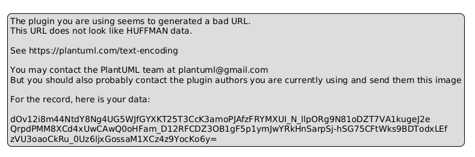

---

## 9. Vista de Despliegue

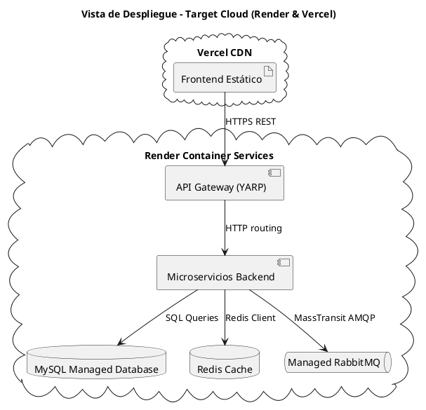
```plantuml
@startuml
title Vista de Despliegue - Target Cloud (Render & Vercel)

cloud "Vercel CDN" {
    artifact "Frontend Estático" as Vercel
}

cloud "Render Container Services" {
    component "API Gateway (YARP)" as RenderGW
    component "Microservicios Backend" as RenderBackend
    database "MySQL Managed Database" as DB
    database "Redis Cache" as Cache
    queue "Managed RabbitMQ" as MQ
}

Vercel --> RenderGW: HTTPS REST
RenderGW --> RenderBackend: HTTP routing
RenderBackend --> DB: SQL Queries
RenderBackend --> Cache: Redis Client
RenderBackend --> MQ: MassTransit AMQP

@enduml
```

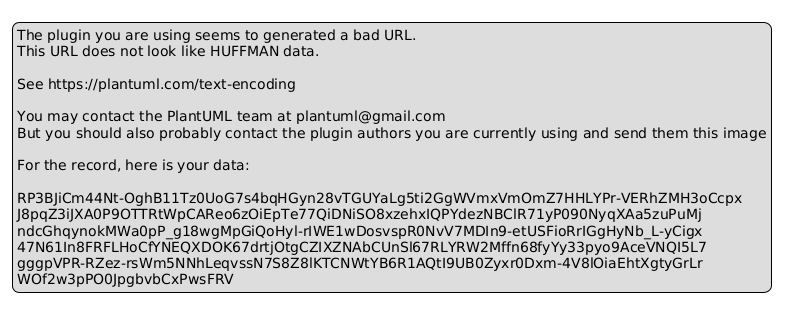

---

## 10. Modelo de Datos (Diagrama ER)

```plantuml
@startuml
title Modelo de Datos - Entity Relationship Diagram

entity "users" as User {
    * id : INT <<PK>>
    --
    * username : VARCHAR(255)
    * email : VARCHAR(255)
    * password_hash : VARCHAR(255)
    full_name : VARCHAR(255)
    phone : VARCHAR(50)
}

entity "profiles" as Profile {
    * id : INT <<PK>>
    --
    * business_name : VARCHAR(255)
    * branch : VARCHAR(255)
    * street : VARCHAR(255)
    * number : VARCHAR(50)
    * city : VARCHAR(255)
    * postal_code : VARCHAR(50)
    * country : VARCHAR(255)
    * phone : VARCHAR(50)
    * legal_id : VARCHAR(50)
}

entity "supplies" as Supply {
    * id : INT <<PK>>
    --
    * supply_name : VARCHAR(255)
    * quantity : INT
    * unit : VARCHAR(50)
    * supplier : VARCHAR(255)
    * price : DECIMAL(10,2)
    * date : DATETIME
    * owner_id : INT
}

entity "stock_movements" as StockMovement {
    * id : INT <<PK>>
    --
    * supply_id : INT <<FK>>
    * quantity : INT
    * type : VARCHAR(50)
    * reason : VARCHAR(255)
    * date : DATETIME
    * owner_id : INT
}

entity "sensor_alerts" as SensorAlert {
    * id : INT <<PK>>
    --
    * device_id : VARCHAR(100)
    * sensor_type : VARCHAR(50)
    * value : DOUBLE
    * unit : VARCHAR(20)
    * timestamp : DATETIME
    * status : VARCHAR(20)
    * is_anomaly : TINYINT(1)
    * owner_id : INT
}

User ||--o| Profile : "Posee"
User ||--o{ Supply : "Es dueño de"
Supply ||--o{ StockMovement : "Registra historial"
User ||--o{ SensorAlert : "Recibe alertas"

@enduml
```

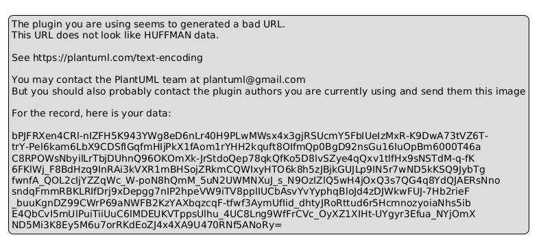
